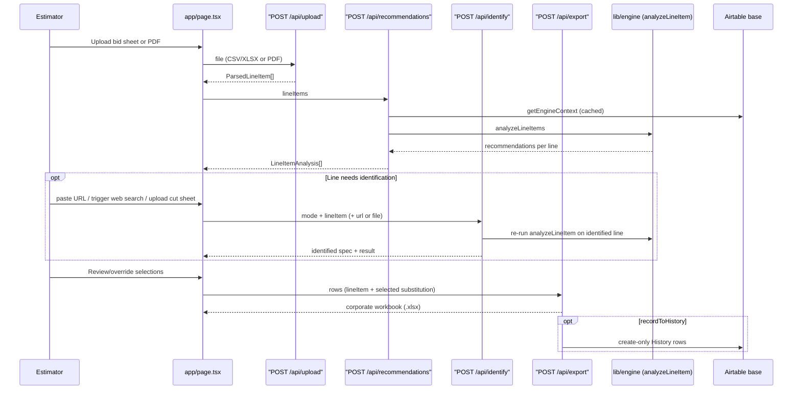

# Architecture Overview

The app is a single Next.js (App Router) project: one client page
(`app/page.tsx`) and four server API routes under `app/api/`. All
domain/business logic lives in `lib/**`, which is framework-agnostic (no
React/Next/Airtable-SDK imports outside the adapter modules) so it can be
unit-tested and reused by the eval harness. `AGENTS.md`/`CLAUDE.md` note this
Next.js version has breaking changes from training-data expectations — check
`node_modules/next/dist/docs/` before writing Next-specific code.

## Request flow

*Upload → recommend → optional per-line identify → export, with History write-back as the closing step of the learning loop.*

## Upload — `POST /api/upload`

`app/api/upload/route.ts`. Accepts multipart form data with a `file` field.

- **Pre-converted sheet path** (`.csv/.txt/.tsv/.xlsx/.xls/.xlsm/.xlsb`, ≤10 MB):
  delegates to `parseWorkbook` in `lib/parse/workbook.ts`, a known-column
  parser (`COLUMN_ALIASES` for mark/qty/manufacturer/catalog/section/project).
  For multi-sheet workbooks, every sheet is parsed and the sheet yielding the
  most line items wins ("healthiest sheet"). Catalog-column selection uses
  alias priority (a column literally labeled "CATALOG #" always beats a
  further-left "Product Code" column) with a data-density fallback — a
  regression fix from a real MedSpa workbook where an empty Product Code
  column hijacked the mapping and dropped every L-series line.
- **Fixture-schedule PDF path** (≤15 MB): delegates to
  `extractScheduleFromPdf` in `lib/identify/schedule.ts`, a single
  user-triggered Claude call (model from `IDENTIFY_MODEL`, default
  `claude-sonnet-5`) that reads the PDF natively and returns the same
  `ParsedLineItem[]` shape via `scheduleRowsToLineItems`. Gated by
  `isIdentifyAvailable()` (requires `ANTHROPIC_API_KEY`); if unset, the route
  returns 503 and tells the estimator to upload a pre-converted sheet instead.

Both paths converge on `ParsedLineItem` (`lib/types.ts`), the shape every
downstream route/engine function operates on.

## Recommendations — `POST /api/recommendations`

`app/api/recommendations/route.ts`. Thin handler: coerces the incoming
`lineItems` (via `lib/parse/coerce.ts`), fetches the (cached) `EngineContext`
via `getEngineContext()` (`lib/airtable/cached.ts`), and calls
`analyzeLineItems` (`lib/engine/recommend.ts`). All scoring/matching logic
lives in the engine — see
<!-- openwiki: broken internal link [/openwiki/engine/recommendation-engine.md] file "/openwiki/engine/recommendation-engine.md" does not exist. Fix the href or restore the target, then delete this comment. -->
[Recommendation Engine](/openwiki/engine/recommendation-engine.md). `GET` on
the same route is a data-path healthcheck returning row counts only (no
record data), used to confirm `AIRTABLE_PAT` and the four tables are reachable.
`maxDuration = 60` because a cold-start context fetch pages through the whole
Airtable base (~130 requests at 5 req/s).

## Per-line identify — `POST /api/identify`

`app/api/identify/route.ts`. Exists because a bid sheet or schedule sometimes
only names a spec well enough for a human, not the engine — the identify flow
gives the engine a manufacturer + catalog number to work with. Three modes,
always **one line per request** (cost guardrail — routes must never sweep a
whole sheet):

- `mode: 'url'` (JSON) — server-side fetch of a pasted spec-sheet link
  (`lib/identify/fetchUrl.ts`, ~10s timeout, SSRF-hygienic: blocks localhost /
  loopback / RFC1918 / link-local hosts) → Claude extraction
  (`lib/identify/claude.ts`) → re-run the engine on the merged line.
- `mode: 'web'` (JSON) — Claude with web search, cited findings → extraction →
  re-run.
- `mode: 'pdf'` (multipart) — Claude reads an uploaded cut-sheet PDF natively
  (vision) → extraction → re-run. Synchronous on `maxDuration = 300` — no job
  queue until real cut sheets prove they exceed the budget.

Every mode ends by merging the resulting `IdentifiedSpec`
(`lib/identify/types.ts`) into the line via `applyIdentifiedSpec`
(`lib/identify/apply.ts`) — manufacturer/catalogNumber are overwritten only
where the identification produced a value — and re-running `analyzeLineItem`
so the UI gets a fresh recommendation set for that one line.
`IdentifiedSpec.category` is constrained to the same vocabulary as the
engine's `CATEGORY_GROUPS` (`lib/engine/matcher.ts`) so an identified line
plugs straight into the existing category gates.

## Export {#export}

`app/api/export/route.ts`. Body is job header fields (job name/location/
customer/sales rep/estimator/bid date) plus `rows: { lineItem, substitution |
null, note? }[]`. Delegates to `buildCorporateWorkbook`
(`lib/export/corporate.ts`), which mirrors Premier's live corporate bid
workbook layout: a `VE DRAFT` sheet with selected substitutions (original spec
recorded in "ESTIMATING NOTES FOR CORS") and an `ORIGINAL SPEC` sheet with the
parsed upload verbatim. **Pricing columns are intentionally left blank** —
this is a takeoff draft for the estimator, never a customer-facing quote.

If the request sets `recordToHistory: true` and the write-back mode is not
`off`, export also writes the selected substitutions back to Airtable
**History** (filtering out RFI/tape lines and passthrough-only rows) via
`writeSelectionsToHistory` — the step that closes the learning loop described
<!-- openwiki: broken internal link [/openwiki/data/airtable-integration.md] file "/openwiki/data/airtable-integration.md" does not exist. Fix the href or restore the target, then delete this comment. -->
in [Airtable Integration](/openwiki/data/airtable-integration.md). A
successful live write invalidates the in-memory engine-context cache so the
next analysis sees the new row immediately. Write-back failure never fails
the export response; the workbook is still returned, with
`X-Writeback-Mode: error` in the headers.

## Configuration surface

| Env var | Purpose | Read in |
|---|---|---|
| `AIRTABLE_PAT` | Airtable auth; absent = app runs on an empty engine context (mock fallback) | `lib/airtable/fetch.ts` |
| `AIRTABLE_BASE_ID` | Overrides the default base `appWj912AEOvtxqJF` | `lib/airtable/schema.ts` |
| `ANTHROPIC_API_KEY` | Claude auth for identify + PDF schedule extraction; absent = those features return 503 | `lib/identify/claude.ts`, `lib/identify/schedule.ts` |
| `IDENTIFY_MODEL` | Overrides the default `claude-sonnet-5` model | `lib/identify/claude.ts`, `lib/identify/schedule.ts` |
| `HISTORY_WRITEBACK` | `live` / `dry_run` / `off` — explicit value always wins; unset defaults to `live` on `VERCEL_ENV=production`, else `dry_run` | `lib/airtable/writeback.ts` |

No `.env` files are committed or read by tooling; treat these only as
env-var names when discussing setup (see the security rule against reading
secret values).

## UI notes

`app/page.tsx` is a single client component: upload, review, identify, and
export in one page. It imports `shouldAutoSelect` directly from
`lib/engine/ranking` (rather than duplicating the gate logic) but otherwise
hand-copies plain-data types (`ParsedLineItem`, `Recommendation`, etc.)
locally instead of importing them from `lib/types.ts` — a known drift risk
flagged in `docs/PHASE3-PRIMER.md`'s UI refinement candidates. `app/layout.tsx`
sets up three fonts (Playfair Display for headers/nav, Cardo, Inter for dense
data content) and static page metadata; there is no routing beyond the single
page and the four API routes.
