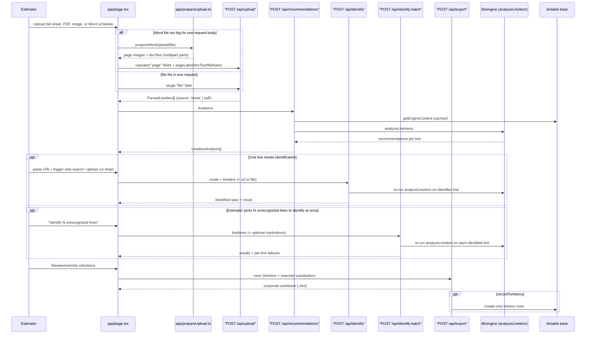

# Architecture Overview

The app is a single Next.js (App Router) project: one client page
(`app/page.tsx`) and five server API routes under `app/api/`
(`upload`, `recommendations`, `identify`, `identify-batch`, `export`). All
domain/business logic lives in `lib/**`, which is framework-agnostic — no
React/Next imports anywhere in `lib/**`, and no Airtable-SDK imports in
`lib/engine/**` specifically — so the engine runs identically inside an API
route, a unit test, and the eval harness. The one deliberate exception to
"framework-agnostic" is `app/prepareUpload.ts`: it is browser-only (uses
`canvas`/`createImageBitmap`) and therefore lives under `app/`, not `lib/`,
even though the `.docx` reading it builds on (`lib/parse/docx.ts`) is
isomorphic and shared with the API route. `AGENTS.md`/`CLAUDE.md` note this
Next.js version has breaking changes from training-data expectations — check
`node_modules/next/dist/docs/` before writing Next-specific code.

Deep identification/extraction mechanics — how Claude turns a URL, a web
search, a cut-sheet document, or a whole fixture schedule into structured
line items — are documented in
[Spec Identification](../workflows/spec-identification.md); this page covers
only each route's contract and where it sits in the request flow.

## Request flow

*Upload (direct or browser-prepared) → recommend → optional per-line or batch identify → export, with History write-back as the closing step of the learning loop.*

## Upload — `POST /api/upload`

`app/api/upload/route.ts`. Accepts multipart form data, either a single
`file` field or a browser-prepared multi-part document (see below). Response
shape: `{ fileName: string, lineItems: ParsedLineItem[], source: 'sheet' | 'pdf', warning? }`.
`source: 'pdf'` means "read by Claude" for PDFs, images, and Word files
alike — it is a route-contract value, not a literal file-type check.

- **Pre-converted sheet path** (`.csv/.txt/.tsv/.xlsx/.xls/.xlsm/.xlsb`, ≤10 MB):
  delegates to `parseWorkbook` in `lib/parse/workbook.ts`, a known-column
  parser (`COLUMN_ALIASES` for mark/qty/manufacturer/catalog/section/project).
  For multi-sheet workbooks, every sheet is parsed and the sheet yielding the
  most line items wins ("healthiest sheet"). Catalog-column selection uses
  alias priority (a column literally labeled "CATALOG #" always beats a
  further-left "Product Code" column) with a data-density fallback — a
  regression fix from a real MedSpa workbook where an empty Product Code
  column hijacked the mapping and dropped every L-series line.
- **Claude-read document path** (PDF, PNG/JPEG/WebP/GIF image, or Word
  `.docx` schedule, ≤15 MB, checked by sniffing bytes — magic numbers for PDF/
  images, ZIP-directory inspection for `.docx` — never by filename or
  browser-reported MIME): delegates to `extractScheduleFromDocument` /
  `extractScheduleFromPages` in `lib/identify/schedule.ts`. A `.docx` is
  planned into pages first via `planDocxPages` (`lib/identify/docxPages.ts`)
  because a Word schedule may hold page-image screenshots, inline table text,
  or a mix of both. Gated by `isIdentifyAvailable()` (requires
  `ANTHROPIC_API_KEY`); if unset, the route returns 503 and tells the
  estimator to upload a pre-converted sheet instead. See
  [Spec Identification](../workflows/spec-identification.md) for the
  extraction mechanics, page-chunking, and cost guardrails.
- **Browser-prepared multi-page path** (repeated `page` fields, parallel
  `pageLabel` fields, plus optional `docText` and `fileName`): the route
  treats each `page` part exactly like any other upload — sniffed from bytes,
  rejected with 415 if unreadable — then calls `extractScheduleFromPages`
  directly. This exists because Vercel refuses a request body over 4.5 MB at
  the platform edge, before the route ever runs, and the browser surfaces
  that as a bare "Failed to fetch" with no diagnosable status. A Word
  schedule's bulk is almost always its embedded page screenshots (tens of KB
  of XML wrapped around several MB of PNGs), so `app/prepareUpload.ts`
  (browser-only: uses `canvas`/`createImageBitmap`) reads the `.docx` with
  the shared isomorphic reader (`lib/parse/docx.ts`), re-encodes each page
  image as JPEG scaled to at most 1568px on the long edge (the vision API's
  own downsample threshold, so nothing is lost), and posts the pages as
  separate multipart parts under Vercel's limit. `prepareWordUpload` returns
  `null` — "just upload the raw `.docx`" — when the document has no page
  images, or when it has literal table rows (content this path cannot carry;
  the API route's own `.docx` reader handles that shape directly). If even
  the most aggressive JPEG quality step cannot bring a document under budget,
  `prepareWordUpload` throws instead of letting a doomed request reach the
  network. A companion pre-flight, `tooLargeForUpload`, lets the UI reject an
  oversized non-Word file before ever calling `fetch`.

All three paths converge on `ParsedLineItem` (`lib/types.ts`), the shape
every downstream route/engine function operates on.

## Recommendations — `POST /api/recommendations`

`app/api/recommendations/route.ts`. Thin handler: coerces the incoming
`lineItems` (via `lib/parse/coerce.ts`), fetches the (cached) `EngineContext`
via `getEngineContext()` (`lib/airtable/cached.ts`), and calls
`analyzeLineItems` (`lib/engine/recommend.ts`). All scoring/matching logic
lives in the engine — see
[Recommendation Engine](../engine/recommendation-engine.md). `GET` on
the same route is a data-path healthcheck returning row counts only (no
record data), used to confirm `AIRTABLE_PAT` and the four tables are reachable.
`maxDuration = 60` because a cold-start context fetch pages through the whole
Airtable base (~130 requests at 5 req/s).

## Per-line identify — `POST /api/identify`

`app/api/identify/route.ts`. Exists because a bid sheet or schedule sometimes
only names a spec well enough for a human, not the engine — the identify flow
gives the engine a manufacturer + catalog number to work with. Three modes,
always **one line per request** (cost guardrail — this route must never
sweep a whole sheet):

- `mode: 'url'` (JSON body: `{ mode, url, lineItem }`) — validates the URL is
  a fetchable public http(s) address first (a hard 400 before any fetch, and
  a distinct 400 for file-share links such as Box/Drive/SharePoint that only
  return a login page); fetches the page server-side; on fetch failure
  (manufacturer sites routinely bot-block direct fetches) it falls back to
  `mode: 'web'` using the pasted URL as a lead rather than failing the line;
  a fetched PDF is read natively, fetched text goes through text extraction.
- `mode: 'web'` (JSON body: `{ mode, lineItem }`) — requires at least a
  manufacturer or catalog value already on the line; runs Claude with web
  search over cited findings.
- `mode: 'pdf'` (multipart/form-data: `mode`, `lineItem` JSON field, `file`)
  — despite the mode name, the uploaded file may be a PDF or an image
  (PNG/JPEG/WebP/GIF, sniffed from bytes, not filename/MIME) up to 15 MB;
  cut sheets arrive as phone photos and screenshots as often as PDFs; Claude
  reads the file natively (vision).

Every mode ends by merging the resulting `IdentifiedSpec`
(`lib/identify/types.ts`) into the line via `applyIdentifiedSpec`
(`lib/identify/apply.ts`) and re-running `analyzeLineItem`, returning
`{ identified: IdentifiedSpec, result: LineItemAnalysis, liveData: boolean }`
so the UI gets a fresh recommendation set for that one line. The route runs
synchronously on `maxDuration = 300` (no job queue, per the handoff decision)
because a vision read of a real cut sheet can take a while. Full extraction
mechanics, the per-call timeout budgets that keep the worst case under both
the client-side abort and this route's `maxDuration`, and the SSRF hygiene on
the URL fetch are covered in
[Spec Identification](../workflows/spec-identification.md).

## Batch identify — `POST /api/identify-batch`

`app/api/identify-batch/route.ts`. The estimator-triggered counterpart to
per-line identify: hands the route the **whole uploaded sheet** (optionally
narrowed to specific `rowIndexes` the estimator picked in the UI) so
`lib/identify/batch.ts` can decide which lines actually need a Claude call —
a line the engine already understands, an RFI placeholder, or LED tape costs
zero calls — and chunk the rest into a bounded number of category-only
calls. This intentionally amends, rather than violates, the per-line "never
sweep a whole sheet" guardrail: it only ever runs because the estimator
pressed a button, it caps the call count, and it does not run web search.
Response: `{ liveData, stats, results: LineItemAnalysis[], failures }` —
only the lines that changed are re-analyzed and returned, so per-line
identifications the estimator already made are never discarded. The engine
context is prefetched concurrently with the Claude calls so a cold Airtable
pull overlaps identification instead of stacking after it. `maxDuration = 300`,
matching `/api/identify`'s budget for the same reason (a long-running
document read). See [Spec Identification](../workflows/spec-identification.md)
for the chunking/cost mechanics.

## Export — `POST /api/export`

`app/api/export/route.ts`. Body is job header fields (job name/location/
customer/sales rep/estimator/bid date) plus `rows: { lineItem, substitution |
null, note? }[]`. Delegates to `buildCorporateWorkbook`
(`lib/export/corporate.ts`), which mirrors Premier's live corporate bid
workbook layout: a `VE DRAFT` sheet with selected substitutions (original spec
recorded in "ESTIMATING NOTES FOR CORS") and an `ORIGINAL SPEC` sheet with the
parsed upload verbatim. **Pricing columns are intentionally left blank** —
this is a takeoff draft for the estimator, never a customer-facing quote.

If the request sets `recordToHistory: true` and the write-back mode is not
`off`, export also writes the selected substitutions back to Airtable
**History** (filtering out RFI/tape lines and passthrough-only rows) via
`writeSelectionsToHistory` — the step that closes the learning loop described
in [Airtable Integration](../data/airtable-integration.md). A
successful live write invalidates the in-memory engine-context cache so the
next analysis sees the new row immediately. Write-back failure never fails
the export response; the workbook is still returned, with
`X-Writeback-Mode: error` in the headers.

Because this repository is public, no route persists — and no wiki page
should ever suggest committing — real customer bid workbooks, pricing data,
or Airtable exports; treat uploaded/exported documents strictly as runtime
data, never as fixtures to check in.

## Configuration surface

| Env var | Purpose | Read in |
|---|---|---|
| `AIRTABLE_PAT` | Airtable auth; absent = app runs on an empty engine context (mock fallback) | `lib/airtable/fetch.ts` |
| `AIRTABLE_BASE_ID` | Overrides the default base `appWj912AEOvtxqJF` | `lib/airtable/schema.ts` |
| `ANTHROPIC_API_KEY` | Claude auth for identify, batch identify, and document/schedule extraction; absent = those features return 503 | `lib/identify/anthropic.ts` |
| `ANTHROPIC_WORKSPACE_ID` | Required only when the API key is identity-linked (the API otherwise rejects every call with `anthropic-workspace-id is required…`); a workspace-scoped key needs no value here | `lib/identify/anthropic.ts` |
| `IDENTIFY_MODEL` | Overrides the default `claude-sonnet-5` model used for per-line identify, batch identify, and schedule extraction | `lib/identify/claude.ts`, `lib/identify/batch.ts`, `lib/identify/schedule.ts` |
| `HISTORY_WRITEBACK` | `live` / `dry_run` / `off` — explicit value always wins; unset defaults to `live` on `VERCEL_ENV=production`, else `dry_run` | `lib/airtable/writeback.ts` |

No `.env` files are committed or read by tooling; treat these only as
env-var names when discussing setup (see the security rule against reading
secret values).

## UI notes

`app/page.tsx` is a single client component: upload, review, per-line and
batch identify, and export in one page. It imports `defaultSelection` and
`hasIdentifiableSignal` directly from `lib/engine/ranking` /
`lib/identify/lineSignal` (rather than duplicating that logic), and imports
`isWordDocument`, `prepareWordUpload`, and `tooLargeForUpload` from
`app/prepareUpload.ts` for the upload path — but otherwise hand-copies
plain-data types (`ParsedLineItem`, `Recommendation`, `IdentifiedSpec`, etc.)
locally instead of importing them from `lib/types.ts`, a known drift risk.
Several client-side constants (`BATCH_LINES_PER_CALL`, `BATCH_MAX_CALLS`,
identify timeout budgets) intentionally mirror server-only constants in
`lib/identify/batch.ts` / `lib/identify/claude.ts` that cannot be imported
into a client component; they exist only to set estimator expectations
before a button press; the server remains authoritative, and drift between
the two can only make the client's estimate slightly stale, never incorrect
behavior. `app/layout.tsx` sets up three fonts (Playfair Display for
headers/nav, Cardo, Inter for dense data content) and static page metadata;
there is no routing beyond the single page and the five API routes.
