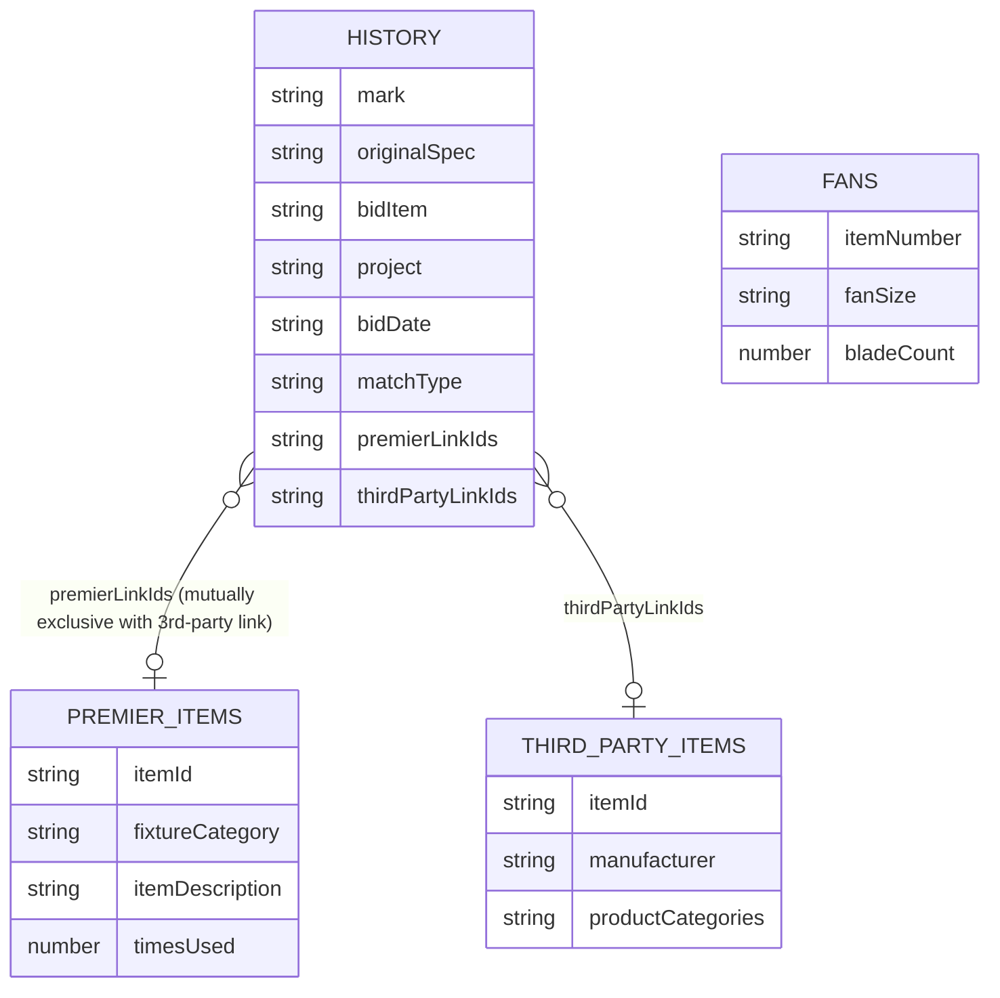

# Airtable Integration

All catalog and historical-decision data lives in one Airtable base
(`appWj912AEOvtxqJF`, overridable via `AIRTABLE_BASE_ID`). Four modules under
`lib/airtable/` form the adapter layer between that base and the framework-
agnostic engine.

## Data model

*`EngineContext` (`lib/types.ts`) bundles History plus the three catalogs; a History row links to at most one of Premier Items or 3rd Party Domestic Items, never both.*

- **History** (`tblHhTXJDNyyZLdvZ`) — past bid line items: what an estimator
  actually did with a spec. This is the labeled data the
  [History matching tiers](../engine/recommendation-engine.md#history-matching-tiers)
  and the [eval harness](../engine/eval-harness.md) both depend on.
- **Premier Items** (`tblXfEOWWjDkpt5tw`) — Premier's own private-label
  catalog, including `Times Used` (feeds the fallback tier's usage bonus).
- **Fans** (`tblII85uQlaASZMF0`) — Premier's ceiling-fan catalog.
- **3rd Party Domestic Items** (`tbl0CaWIugEoo8gwo`) — non-Premier-manufactured
  items Premier resells; symmetric role to Premier Items but no `Times Used`.

## Schema — field IDs, not names

`lib/airtable/schema.ts` binds every field the app reads/writes by Airtable
**field ID** (immutable for the life of the field), not by human label —
because someone renaming a column in the live base would otherwise silently
break the app. The constant identifier names the field's *role* in the code
(e.g. `PREMIER_LINK`); the trailing comment records the human label as of the
date noted in the file header, for readability only. When the base changes,
update the comment; when a field is genuinely renamed/replaced, update the ID.

Notably: `HISTORY_FIELDS.PREMIER_LINK` and `HISTORY_FIELDS.THIRD_PARTY_LINK`
are mutually exclusive per the schema's own design contract — a History row
links to one catalog or neither, never both, which is why the engine can
treat "resolved Premier item" and "resolved 3rd-party item" as alternatives
rather than needing to reconcile both.

## Fetch, cache, and staleness

`lib/airtable/fetch.ts` (`fetchEngineContext`) is the only place
`AIRTABLE_PAT` is read; it must never be imported from a client component.
Without the PAT set, every fetch returns an empty context (`
isLiveDataAvailable()` reports this) so the app still builds and runs
credential-less — API routes surface that as `liveData: false` in their
responses.

`lib/airtable/cached.ts` wraps that fetch in an in-memory, per-instance cache
(TTL 5 minutes) instead of Next's `unstable_cache`, because the full context
(~9.4K history rows + ~3.2K catalog items) serializes past the 2 MB limit
`unstable_cache` enforces, which was turning every cache write into a runtime
500 on Vercel. The cache is stale-while-revalidate: once the TTL elapses, a
request is served the stale context immediately while a background refresh
runs, so no estimator request blocks on a full Airtable re-pull.
`invalidateEngineContext()` drops the cache outright — called by
`/api/export` right after a successful live History write so the *next*
analysis sees the new rows immediately rather than waiting out the TTL.

## History write-back — the learning loop

`lib/airtable/writeback.ts` implements the step that makes exported decisions
feed back into future recommendations, triggered from
`/api/export` (see [Architecture Overview](../architecture/overview.md#export))
when the request sets `recordToHistory: true`.

Safety contract:
- **Create-only.** This module never updates or deletes History records.
- **Mode gate** — `HISTORY_WRITEBACK` env var (`live` / `dry_run` / `off`)
  always wins when set; unset, it defaults to `live` on
  `VERCEL_ENV=production` and `dry_run` everywhere else, so non-production
  deployments never write real History rows by accident.
- **Dedupe guard** — a row whose `(project, normalized mark, normalized
  Original Spec, normalized Bid Item)` already exists in History is skipped
  (`writebackKey`, shared normalization with the engine's
  `normalizeSpecKey`/`normalizeProductId`).
- Only **selected substitutions** are written — RFI, LED-tape, and
  passthrough-only rows are filtered out before write-back, so guesses that
  were never real decisions can't enter History.
- `Bid Date` is set to the export date, which is exactly what activates
  [recency weighting](../engine/recommendation-engine.md#history-matching-tiers)
  for that row in future analyses.
- The engine's `matchConfidence` at export time is recorded to History's
  `Spec Match Confidence` field, so a 30%-confidence category guess an
  estimator accepted is distinguishable from a 95%-authoritative swap —
  though nothing currently *consumes* that field downstream (a documented
  open backlog item in `docs/PHASE3-PRIMER.md`).

This is the mechanism the
[auto-select gate](../engine/recommendation-engine.md#ranking-dedupe-and-the-auto-select-gate)
is designed to protect: a pre-checked low-confidence guess that gets
exported would otherwise write itself into History and could eventually
reach the authoritative 95% floor purely on volume, with no real estimator
endorsement behind it.
