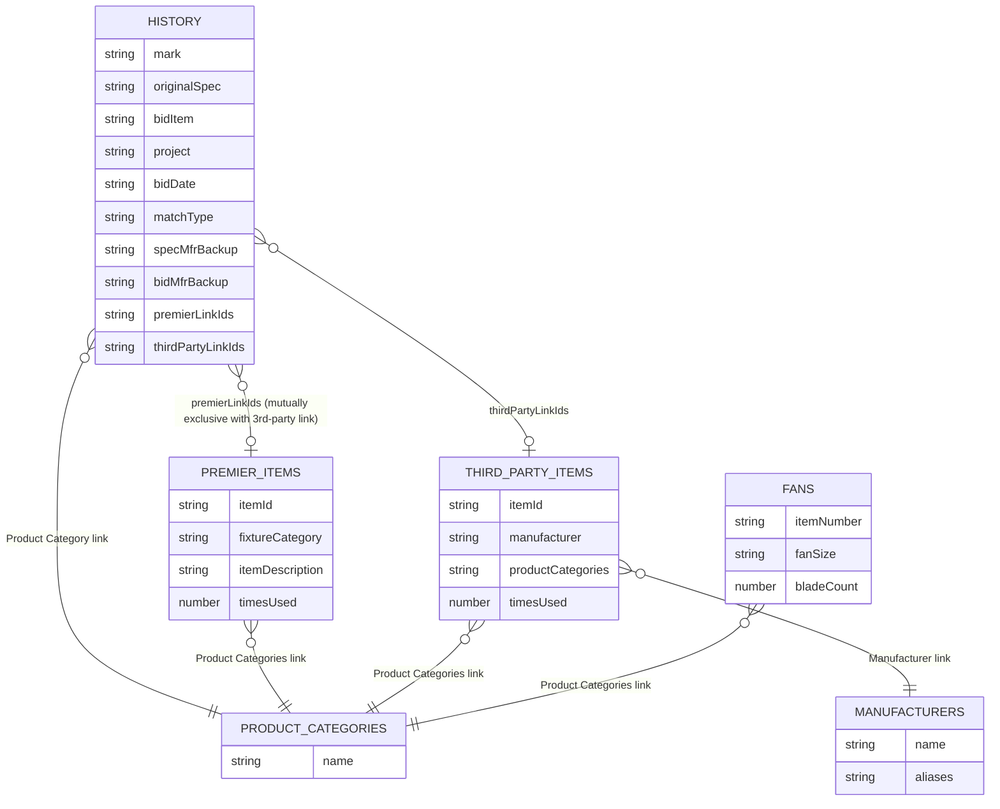

# Airtable Integration

All catalog and historical-decision data lives in one Airtable base
(`appWj912AEOvtxqJF`, overridable via `AIRTABLE_BASE_ID`). The modules under
`lib/airtable/` form the adapter layer between that base and the framework-
agnostic engine.

## Data model

*`EngineContext` (`lib/types.ts`) bundles History plus the three catalogs; a History row links to at most one of Premier Items or 3rd Party Domestic Items, never both. Product Categories and Manufacturers are shared vocabulary/registry tables the other tables link into, not part of `EngineContext` itself — the adapter resolves them to display strings at fetch time (see below).*

- **History** (`tblHhTXJDNyyZLdvZ`) — past bid line items: what an estimator
  actually did with a spec. This is the labeled data the
  [History matching tiers](../engine/recommendation-engine.md#history-matching-tiers)
  and the [eval harness](../engine/eval-harness.md) both depend on.
- **Premier Items** (`tblXfEOWWjDkpt5tw`) — Premier's own private-label
  catalog, including `Times Used` (feeds the fallback tier's usage bonus).
- **Fans** (`tblII85uQlaASZMF0`) — Premier's ceiling-fan catalog.
- **3rd Party Domestic Items** (`tbl0CaWIugEoo8gwo`) — non-Premier-manufactured
  items Premier resells; symmetric role to Premier Items. It has no stored
  "Times Used" count field, so the adapter derives one by counting the
  reverse-link **History** field's linked rows (`THIRD_PARTY_FIELDS.HISTORY`)
  — same signal as Premier's real count, one hop further.
- **Product Categories** (`tblwHPGnJO6gYUxTL`) — the single category
  vocabulary every catalog table (and History) now links into, added in a
  2026-09 consolidation that replaced several independent per-table
  category selects/lookups.
- **Manufacturers** (`tbleN09zl5u0LNQjI`) — the brand registry that 3rd
  Party Domestic Items and History link to, with an `Aliases` field
  recording the spelling variants seen in the wild before the link existed.

## Schema — field IDs, not names

`lib/airtable/schema.ts` binds every field the app reads/writes by Airtable
**field ID** (immutable for the life of the field), not by human label —
because someone renaming a column in the live base would otherwise silently
break the app. The constant identifier names the field's *role* in the code
(e.g. `PREMIER_LINK`); the trailing comment records the human label as of the
date noted in the file header, for readability only. When the base changes,
update the comment; when a field is genuinely renamed/replaced, update the ID.

Notably: `HISTORY_FIELDS.PREMIER_LINK` and `HISTORY_FIELDS.THIRD_PARTY_LINK`
are mutually exclusive per the schema's own design contract — a History row
links to one catalog or neither, never both, which is why the engine can
treat "resolved Premier item" and "resolved 3rd-party item" as alternatives
rather than needing to reconcile both.

### Lookup → linked-record migrations, and why the adapter resolves names itself

Several fields silently changed *type* in the 2026-09 consolidation, from a
lookup/select that returned a display string to a `multipleRecordLinks` field
that returns bare Airtable record IDs over REST: History's `Product Category`,
Premier's and Fans' `Product Categories`, 3rd Party's `Product Categories` and
`Manufacturer`. `asString()` in `lib/airtable/fetch.ts` deliberately drops
anything shaped like a record ID (`rec…`) rather than displaying it, so
without extra work these fields would silently read empty — which is exactly
what happened to 3rd Party's category badges before the fix (they rendered
literal ids like `recVezggjIVgwPmsg`).

The fix is `fetchLinkedNames()`: a small one-extra-request lookup of the
Product Categories or Manufacturers table (each only ~30–80 rows) into an
`id → name` map, which `fetchHistory`, `fetchPremierItems`, and
`fetchThirdPartyItems` use to resolve link fields to names before building
each row. If that lookup itself fails, it degrades to blank values for that
field rather than failing the whole context fetch — a missed category gate is
recoverable, a dead app is not.

History's `Spec Manufacturer` / `Bid Manufacturer` fields also became linked
records, but the adapter deliberately does **not** resolve them the same way:
`fetchHistory` always sets `specManufacturer`/`bidManufacturer` to `''` and
carries the plain-text `Spec Manufacturer (text)` / `Bid Manufacturer (text)`
fields (`specMfrBackup`/`bidMfrBackup`) as the values the engine actually
scores against. Both the matching engine and the write-back module
(`toAirtableFields`) read/write those text backup fields, not the linked
fields — so a manufacturer link on a History row is present in the base for
reference but is not part of the app's data flow.

## Fetch, cache, and staleness

`lib/airtable/fetch.ts` (`fetchEngineContext`) is the only place
`AIRTABLE_PAT` is read; it must never be imported from a client component.
Without the PAT set, every fetch returns an empty context (`
isLiveDataAvailable()` reports this) so the app still builds and runs
credential-less — API routes surface that as `liveData: false` in their
responses. The four tables are fetched **sequentially**, not in parallel,
because Airtable caps a base at 5 requests/second with a 30-second penalty
window on bursts; pages within one table are already serial, so the whole
~130-request pull (History + three catalogs + the two vocabulary lookups)
stays under the cap at the cost of a ~30s cold start, after which the
in-memory cache takes over.

**A missing pinned field degrades one field, not the whole table.**
Requesting a field ID Airtable no longer has is a hard 422 on the *entire*
table `select()` call — one column removed in the Airtable UI (a 2026-09-01
consolidation that dropped Premier's `Style` and History's `Spec Vendor`)
took the whole catalog and History offline in production, with the app
showing "Catalog offline" and nothing to explain why. `selectAll()` in
`fetch.ts` now catches that specific 422, parses the missing field ID out of
Airtable's error message, drops just that field, and retries — bounded to at
most one retry per originally-requested field, so it cannot loop. The drop is
logged loudly (`console.error`) rather than silently tolerated, because a
pinned field going missing is a real defect even though it should no longer
be an outage; `scripts/schema-audit.ts` is the deliberate way to find and fix
it. The Fans table fetch additionally treats *any* failure (missing table,
not just a missing field) as "no fans" rather than failing the whole context,
since Fans is optional in the source app.

`lib/airtable/cached.ts` wraps `fetchEngineContext` in an in-memory,
per-instance cache (TTL 5 minutes) instead of Next's `unstable_cache`,
because the full context (~9.4K history rows + ~3.2K catalog items)
serializes past the 2 MB limit `unstable_cache` enforces, which was turning
every cache write into a runtime 500 on Vercel. The cache is
stale-while-revalidate: once the TTL elapses, a request is served the stale
context immediately while a background refresh runs, so no estimator request
blocks on a full Airtable re-pull. Module scope survives warm serverless
invocations; a cold start just refetches. `invalidateEngineContext()` drops
the cache outright — called by `/api/export` right after a successful
**live** write-back (`mode === 'live' && written > 0`) so the *next* analysis
sees the new rows immediately rather than waiting out the TTL.

## History write-back — the learning loop

`lib/airtable/writeback.ts` implements the step that makes exported decisions
feed back into future recommendations, triggered from
<!-- openwiki: broken internal link [../architecture/overview.md#export] heading anchor "export" does not exist in "../architecture/overview.md". Fix the href or restore the target, then delete this comment. -->
`/api/export` (see [Architecture Overview](../architecture/overview.md#export))
when the request sets `recordToHistory: true`. A write-back failure never
fails the export itself — the route wraps the call in a try/catch and always
returns the workbook, surfacing write-back outcome only via `X-Writeback-*`
response headers.

Safety contract:
- **Create-only.** This module never updates or deletes History records.
- **Mode gate** — `HISTORY_WRITEBACK` env var (`live` / `dry_run` / `off`)
  always wins when set; unset, it defaults to `live` on
  `VERCEL_ENV=production` and `dry_run` everywhere else, so non-production
  deployments never write real History rows by accident.
- **Dedupe guard** — a row whose `(project, normalized mark, normalized
  Original Spec, normalized Bid Item)` already exists in History is skipped
  (`writebackKey`, shared normalization with the engine's
  `normalizeSpecKey`/`normalizeProductId`), and duplicates within the same
  incoming batch are caught the same way.
- **Bid-manufacturer backfill** — before dedupe/write, `backfillBidManufacturers`
  fills any row whose `bidManufacturer` is empty from a majority vote across
  existing History rows for the same normalized bid item (never a brand
  guess — it only uses manufacturers other estimators already recorded for
  that exact item, and never overwrites a manufacturer that's already set).
  This exists because prefix-based manufacturer inference misses items like
  "REMINGTON…" or "FLAIRE…" that carry no recognizable own-brand prefix.
- Only **selected substitutions** are written — RFI, LED-tape, and
  passthrough-only rows are filtered out before write-back, so guesses that
  were never real decisions can't enter History.
- `Bid Date` is set to the export date, which is exactly what activates
  [recency weighting](../engine/recommendation-engine.md#history-matching-tiers)
  for that row in future analyses.
- The engine's `matchConfidence` at export time is recorded to History's
  `Spec Match Confidence` field (e.g. `"30%"`), so a 30%-confidence category
  guess an estimator accepted is distinguishable from a 95%-authoritative
  swap — though nothing currently *consumes* that field downstream (a
  documented open backlog item in `docs/PHASE3-PRIMER.md`).
- Manufacturer values are written to the plain-text `Spec Manufacturer
  (text)` / `Bid Manufacturer (text)` fields, never to the linked-record
  manufacturer fields — consistent with how those same text fields are read
  back on the next fetch (see the schema section above).
- Live writes batch 10 records per Airtable create call with a 250ms delay
  between batches to stay under the 5 req/s base cap; a failed batch is
  recorded in `WritebackResult.errors` but does not stop the remaining
  batches from being attempted.

This is the mechanism the
[auto-select gate](../engine/recommendation-engine.md#ranking-dedupe-and-the-auto-select-gate)
is designed to protect: a pre-checked low-confidence guess that gets
exported would otherwise write itself into History and could eventually
reach the authoritative 95% floor purely on volume, with no real estimator
endorsement behind it.

## Keeping the schema binding correct

`npx tsx --env-file=.env scripts/schema-audit.ts` is the read-only tool that
checks every field ID in `lib/airtable/schema.ts` against the live base's
metadata API, table by table (History, Premier Items, Fans, 3rd Party
Domestic Items, Manufacturers, Product Categories). It reports three
categories per table: **MISSING** (a pinned field ID no longer on the live
table — a silent breakage waiting to happen, since the adapter would read
`undefined` and matching would degrade without ever throwing, until the
whole-table 422 case above kicks in), **RENAMED** (the field still exists but
its human label changed, so the `schema.ts` comment is stale — documentation
only, not a bug), and **UNPINNED** (a live field the app does not read —
mostly informational, but useful for spotting a newly added field that
*should* be read). Run it after any live schema edit, and first whenever
matching quality drops for no apparent reason.
