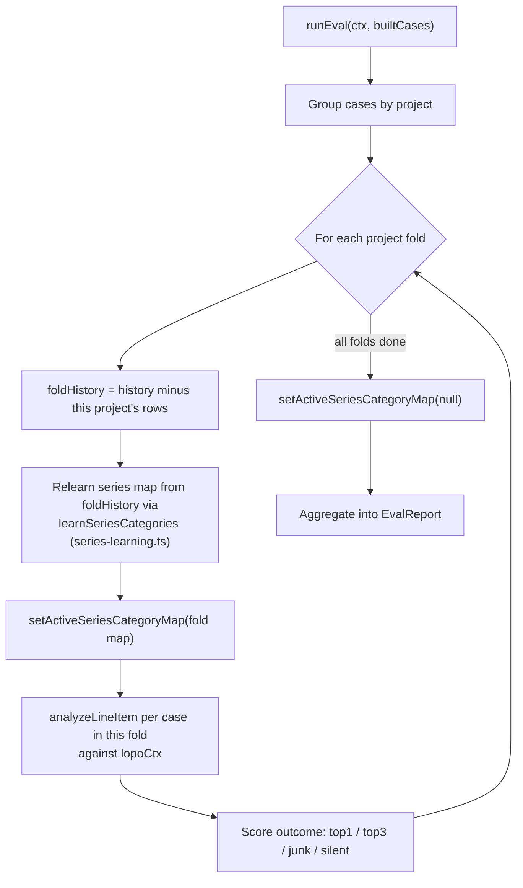

# Accuracy Eval Harness

The [recommendation engine](recommendation-engine.md) is
complex enough that a change can quietly regress accuracy for whole classes
of specs. This harness makes that measurable instead of anecdotal: it treats
every linked Airtable **History** row as a labeled outcome ("this spec →
that item, chosen by a real estimator") and replays each one through
`analyzeLineItem` to check whether the engine would have found the same
answer. It is documented in full detail in `docs/EVAL-HARNESS.md`; this page
summarizes the mechanism and code layout.

## How a case is built

A History row becomes a labeled case (`lib/eval/harness.ts`) when all hold:

1. `matchType !== 'NON-ITEM'` (freight lines etc. aren't spec→item outcomes);
2. it links to a resolvable catalog record (Premier or 3rd Party) — the
   linked item's Item ID is the label;
3. its Original Spec is ≥3 characters and not a pasted URL;
4. its project is not quarantined — currently only `'Collective Medspa'`
   (`QUARANTINED_PROJECTS` in `lib/eval/harness.ts`), a mechanics-test export
   of default selections that are not real estimator endorsements.

Rows sharing `(project, normalized spec)` collapse into one case whose label
set is every item chosen for that spec, so a multi-item fulfillment counts as
a hit if the engine surfaces any of its items.

## Leave-one-project-out (LOPO)

Each case runs against an `EngineContext` whose History **excludes every row
from the case's own project** — otherwise the History tier would trivially
return the label from its own row, testing a lookup instead of a prediction.
Cross-project evidence stays available, which is exactly what the
[History matching tiers](recommendation-engine.md#history-matching-tiers)
are meant to exploit. `referenceDate` is pinned to the snapshot's fetch time
so recency weighting is reproducible. Quarantined projects are excluded not
just as cases but as evidence for every other fold too.

`runEval` (`lib/eval/harness.ts`) groups cases by project so the LOPO context
is built once per fold rather than once per case:

*Per-project fold loop in `runEval`: history and the learned series map are
both rebuilt per fold, then the committed series map is restored afterward.*

### Why the series map is relearned per fold, not just the History rows

The [learned series-category map](recommendation-engine.md#learned-series-categories)
that the engine consults is a committed artifact, and the logic that builds
it — grouping History rows by a spec's leading series token and voting on a
`Fixture Category`/`Product Categories` label with `MIN_SUPPORT`/
`MIN_AGREEMENT` thresholds — lives in `lib/engine/series-learning.ts`
(`learnSeriesCategories`, `toSeriesCategoryMap`), not in
`scripts/build-series-map.ts` itself. That script is only the production
entrypoint: it loads the full frozen snapshot and calls into
`series-learning.ts` to write the committed `lib/engine/series-categories.ts`
that production runs on.

`lib/eval/harness.ts` calls the exact same `learnSeriesCategories` function,
but over `foldHistory` (the LOPO-filtered history for the project under
test) instead of the whole corpus, and installs the result via
`setActiveSeriesCategoryMap` for the duration of that fold only — resetting
it to `null` once every fold has run so a stale fold map can't leak into a
later vitest suite sharing the same module registry. Early LOPO only withheld
raw History *rows* and still scored folds against the committed,
whole-corpus series map; that let a project's own rows teach the map a
series it was then "recognized" by, which is the label reaching the input
through a side channel. Measured on the frozen 2026-08-31 snapshot, 77 of the
129 keys in a widened map had support from a single project, and hits
resting on those keys accounted for 3.93 of a reported 16.87% top1 — most of
an apparent +2.27pp improvement was that leak, not real accuracy. Production
is unaffected: it keeps the full committed map, where a series learned from
one past job is legitimate knowledge for the *next* bid — it just cannot be
the thing that scores that same job's own case. This per-fold relearning is
what makes the eval's leave-one-project-out design honest rather than
leave-one-project's-rows-out.

## Metrics

Passthrough cards ("Left as-spec", "Already a Premier item") are set aside;
against the label:

- **top1** — the first substantive recommendation is the label.
- **top3** — the label appears anywhere among the (≤3) substantive
  recommendations.
- **junk** — recommendations were shown, none is the label.
- **silent** — no substantive recommendation at all.
- **autoWrong** — the top card clears `shouldAutoSelect`
  (see [ranking gate](recommendation-engine.md#ranking-dedupe-and-the-auto-select-gate))
  **and** is not the label — the learning-loop-pollution quadrant, since an
  auto-selected wrong answer is exactly what a careless export would write
  back to History.

`top3 + junk + silent = 100%`. Metrics are reported for a **headline** slice
(pipeline classes `'standard'` + `'bulb'`, where a substitution is expected,
with as-spec cases excluded) plus separate slices for `'tape'`/`'rfi'` lines
(engine-intended suppressions, not scored as failures) and "as-spec" cases
(where the labeled outcome IS the input spec — the correct engine answer
there is a passthrough or silence, which substitution metrics can't credit).
Further slices by spec style (prose vs. catalog), label source
(premier/third-party), and per-project are also reported.

## The ratchet

`npm run eval` (and the vitest guard in `__tests__/eval.test.ts`) compare a
run against the committed `__tests__/eval.baseline.json`:

- fails if any headline metric moves the wrong way beyond 0.25 percentage
  points (top1/top3 down, junk/silent/autoWrong up), or the case count
  changes;
- fails if the baseline's dataset fingerprint doesn't match the snapshot
  (stale baseline after a snapshot refresh);
- passes on improvement, nudging toward `npm run eval:update`.

This ratchet is what makes `.github/workflows/ci.yml`'s `vitest run` step an
**enforcing** accuracy gate, not an advisory one. The repository is public,
and the eval dataset is not fetched live in CI — it is the committed, frozen
snapshot fixture (`__tests__/eval.context.json.gz`, refreshed offline by
`npm run eval:fetch`, which itself requires `AIRTABLE_PAT`). CI only ever
replays that already-committed fixture through the engine, so no Airtable
credential needs to exist in the CI environment at all. See
[Testing & CI](../operations/testing-and-ci.md) for the full CI workflow.

**Hard rule: `npm run eval:update` is never run to make a failing regression
check pass.** The committed baseline only moves as a deliberate, reviewed
trade-off — a PR that changes the numbers is expected to show *why* (which
cases flipped and in which direction) as part of its review, per the
change → measure → review the flips → `npm run eval:update` → commit code
and baseline together workflow. Treating a red ratchet as something to
silence by re-baselining defeats the entire point of having it.

## Files and commands

| File | Role |
|---|---|
| `lib/eval/harness.ts` | Pure core: case construction, LOPO evaluation (including per-fold series-map relearning), metrics, baseline ratchet. No I/O. |
| `lib/eval/dataset.ts` | Snapshot load/save (gzip), sha256 fingerprinting for the ratchet's staleness check. |
| `scripts/eval/run.ts` | CLI entry point for `npm run eval` / `npm run eval:update`. |
| `scripts/eval/fetch-context.ts` | Refreshes `__tests__/eval.context.json.gz` from the live Airtable base (needs `AIRTABLE_PAT`). |
| `__tests__/eval.context.json.gz` + `__tests__/eval.context.meta.json` | The frozen `EngineContext` (full History + all three catalogs) and its plain-JSON provenance mirror (fetch date, row counts, notes). |
| `__tests__/eval.baseline.json` | Committed metrics plus one line per case outcome, so a PR that flips cases shows exactly which ones in its diff. |
| `lib/engine/series-learning.ts` | Owns the series→category learning logic (`learnSeriesCategories`, `toSeriesCategoryMap`) as a pure function of a history corpus. Called from two places over two different corpora: `scripts/build-series-map.ts` (whole snapshot → committed production map) and, per LOPO fold, `lib/eval/harness.ts` (that fold's history only) — see [above](#why-the-series-map-is-relearned-per-fold-not-just-the-history-rows). |
| `scripts/build-series-map.ts` | Production entrypoint only: loads the frozen snapshot and calls into `series-learning.ts` to (re)generate the committed [learned series-category map](recommendation-engine.md#learned-series-categories) (`lib/engine/series-categories.ts`) that the engine runs on. It does not itself decide how the eval measures accuracy. |

Commands (`package.json`):

- `npm run eval` — full run + report + baseline comparison; exits 1 on
  regression.
- `npm run eval -- --failures=25` — also prints the worst misses.
- `npm run eval -- --max-cases=200` — quick deterministic partial run.
- `npm run eval:update` — full run + rewrite the baseline; commit code +
  baseline together, per the change → measure → update → commit workflow.
  Only run this as part of a deliberate, reviewed trade-off — never to
  silence a regression.
- `npm run eval:fetch` — refresh the frozen snapshot from live Airtable.

## Current baseline snapshot

The committed `__tests__/eval.baseline.json` is the source of truth for the
live numbers, not this page — read it and rerun `npm run eval` before citing
a figure. As committed, it reports **981 headline cases**: top1 13.76%,
top3 17.43%, junk 39.65%, silent 42.92%, autoWrong 0.71%, generated from a
snapshot fetched 2026-09-02 (`__tests__/eval.context.meta.json`; 9,491
history / 2,339 Premier / 1,115 third-party / 113 fan rows).

That snapshot followed a base **consolidation** (unifying four parallel
category systems onto one shared `Product Categories` table, deduplicating
catalog rows, and folding manufacturer-name variants into one registry) that
changed the dataset fingerprint and moved the case count from 971 to 981 —
per `eval.context.meta.json`, that comparison is explicitly **not**
like-for-like, and every headline metric held or improved on the larger case
set (pre-consolidation: top1 13.49%, top3 17.20%, junk 39.65%, silent
43.15%, autoWrong 0.72%). Both the pre- and post-consolidation figures
supersede the substantially worse numbers `docs/PHASE4-PRIMER.md` recorded at
its Phase 4 kickoff (top1 9.01%, top3 11.28%, junk 45.55%, silent 43.17%,
autoWrong 6.94%, on a since-superseded 966-case baseline) — the gap reflects
the family/series-matching tier, the learned series-category map, a
null-category junk gate, and the exact-history confidence/auto-select
rework (see
[Recommendation Engine](recommendation-engine.md#history-matching-tiers)),
plus, later, the per-fold series-map fix described above that removed a
measurement leak. Treat every number on this page as point-in-time
reference: read `__tests__/eval.baseline.json` for the current figures.
