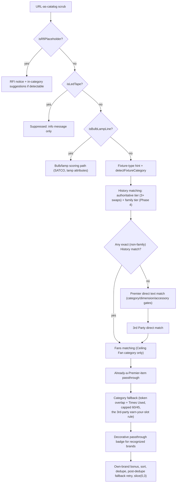

# Recommendation Engine

The engine is the core intellectual property of this app: given one parsed
bid line, decide what Premier Lighting substitution(s) to suggest, at what
confidence, and whether the UI should pre-check one by default. It lives
entirely in `lib/engine/` (`matcher.ts`, `ranking.ts`, `recommend.ts`,
`categories.ts`, `series-learning.ts`, and the generated
`series-categories.ts`) and **must remain pure TypeScript — no React, no
Next.js, no Airtable SDK** — so it can run identically inside API routes,
unit tests, and the [accuracy eval harness](eval-harness.md). This is an
invariant, not a style preference: the eval harness imports these modules
directly against a frozen JSON snapshot, and any accidental framework or SDK
import would break that.

Entry points (`lib/engine/recommend.ts`):
- `analyzeLineItem(lineItem, ctx)` — the full pipeline for one line, returning
  `{ lineItem, recommendations, infoMessage? }`. Called by
  `/api/identify` per-line and by the eval harness.
- `analyzeLineItems(lineItems, ctx)` — batch wrapper called by
  `/api/recommendations`.
- `recommendForLineItem(lineItem, ctx)` — returns just the `Recommendation[]`;
  used by the parity test fixtures.

`ctx` is an `EngineContext` (`lib/types.ts`): History rows plus the Premier
Items, 3rd Party Domestic Items, and Fans catalogs — see
[Airtable Integration](../data/airtable-integration.md) for where this
comes from and how it is kept current.

## The `analyzeLineItem` pipeline

Order matters: each stage can return early (suppressing later stages) or
gate what later stages are allowed to surface. `lib/engine/recommend.ts`'s
header comment and `docs/PHASE3-PRIMER.md` both document this order; the
current implementation is:

*Each line item runs top-to-bottom through `analyzeLineItem`; a category-detected line is never allowed to end silent (see the post-dedupe fallback retry).*

1. **URL-as-catalog scrub** — a spec-sheet link pasted into the catalog field
   is stripped before matching so it never becomes junk input.
2. **RFI placeholder** (`isRfiPlaceholder`, `matcher.ts`) — TBD/missing
   specs get an informational banner, plus category-level suggestions if a
   category can still be detected from surrounding text. Never fabricates a
   swap.
3. **LED tape suppression** (`isLedTape`, `matcher.ts`) — tape runs are
   project-specific; suppressed with an info message, by design (not a
   failure — the eval harness reports these separately as pipeline class
   `'tape'`).
4. **Bulb/lamp path** (`isBulbLampLine`, `isSatcoLampNumber`,
   `extractLampAttributes` — all `matcher.ts`) — SATCO lamp
   numbers and companion bulb lines route to a dedicated scorer (shape/Kelvin/
   wattage attributes), never fixture candidates.
5. **Fixture-type hint + `detectFixtureCategory`** (`matcher.ts`) —
   category inference cascade: an explicit fixture-type-hint column wins
   first, then the **learned series map** (see below), then regex/keyword
   branches per category (Ceiling Fan, Vanity, Pendant, Sconce, Recessed,
   Linear, Exit/Emergency, Outdoor, Ceiling, Mirror, Undercabinet). Returns
   `null` when nothing matches — a null category is itself a gate condition
   downstream (see the null-category junk gate below).
6. **History matching** (`recommend.ts`, the main `bidItemMatchMap` loop) —
   see [History matching tiers](#history-matching-tiers) below.
7. **Premier direct match** — only runs when History produced no exact
   (non-family) match (`recommend.ts`, `hasHistoryMatches`). Scores every
   Premier Items row via `calculateCatalogMatchScore`, gated by category
   compatibility (`categoriesCompatible`), the dimension hard-gate
   (`dimensionsCompatible`), and the accessory gate (`isAccessoryItem` /
   `specWantsAccessory`). Includes the **null-category junk gate**: `const
   idScoreFloor = inferredCategory ? 40 : 55` — with no category to gate on,
   matching requires a stronger token-overlap score before a candidate
   surfaces at all, trading junk for silence on unknown lines (Phase 4
   backlog #5; the identify flow is meant to absorb that silence).
8. **3rd Party direct match** — mirrors the Premier block on the 3rd Party
   Domestic Items table; no own-brand bonus; its own floor. Includes its own
   "already carried" passthrough: when the spec's catalog number IS a resold
   3rd-party Item ID, the card is "carry as spec" (confidence 99, source
   `'3rd Party'`) rather than a sibling variant — a fuzzy-confidence sibling
   pre-checked here would write a phantom swap to History on export. This
   direct-match tier is an item-# identity check, not a ranking contest
   against Premier, so it is not subject to the category-fallback
   earn-your-slot rule described below — if the spec's catalog number really
   is a resold item, it IS the answer.
9. **Fans matching** — only evaluated when the inferred category is
   `'Ceiling Fan'`; uses `fanSpansCompatible` for blade-span dimension gating.
   Skipped when History already produced 2+ non-family matches
   (`skipFanSearch`).
10. **Already-a-Premier-item passthrough** — a last-resort check (only when
    nothing else in steps 6-9 produced a recommendation): an exact match on
    the spec's own catalog number in the Premier Items table is surfaced as
    "already a Premier / Global Concepts item," not a swap.
11. **Category fallback** (`categoryFallbackRecommendations`) — token-overlap
    + Times Used across Premier and 3rd-party, always `matchType: 'partial'`,
    capped at 60 (description-based) / 45 (usage-based). This is where the
    **3rd-party earn-your-slot rule** applies — see
    [The 3rd Party table is context, not a catalog](#the-3rd-party-table-is-context-not-a-catalog)
    below.
12. **Decorative passthrough badge** — recognized high-end brands
    (`PASSTHROUGH_DECORATIVE_BRANDS` in `recommend.ts`: Hubbardton Forge,
    Visual Comfort, Circa Lighting, Arteriors, Currey, Fine Art, Tech
    Lighting, Kelly Wearstler, plus some consumer/designer retail brands)
    with no match are surfaced "↻ Left as-spec" rather than dropped or given
    a bogus swap.
13. **Own-brand bonus, sort, dedupe, retry, slice** — see
    [Ranking, dedupe, and the auto-select gate](#ranking-dedupe-and-the-auto-select-gate).

## History matching tiers

Every History row is scored against the input spec (`recommend.ts`, the
`bidItemMatchMap` loop and the per-bid-item pass that follows it). Two
evidence tiers can produce a `source: 'History'` recommendation, and the
non-family tier's confidence/eligibility model was substantially reworked
(2026-08-05, "exact-history confidence rework") after measuring that the old
flat curve punished exactly the evidence the system exists to learn from:

- **Authoritative tier** — `trueMatchingSwaps`: History rows whose normalized
  Original Spec **exactly** equals the input's normalized key. A match is
  authoritative only when *all three* hold: `matchingSwapCount >=
  AUTHORITATIVE_SWAP_COUNT` (3), the spec is `identifiableSpec` (see below —
  a real product identity, not generic vocabulary), and `agreementShare >
  0.5` — a **strict majority** of every History row that carries this exact
  spec chose this item (not just an absolute swap count), so a 3-vs-3 split
  can never mint two competing "authoritative" answers. When authoritative,
  confidence is floored at `AUTHORITATIVE_CONFIDENCE` (95), `matchType:
  'exact'`, reason `"✓ Bid N times — same spec → same item"`. This is settled
  precedent: the same spec→item swap has been made by estimators 3+ times,
  on a real product identity, with majority agreement.
- **Sub-authoritative exact-spec evidence** — same normalized-key equality,
  but failing one of the three authoritative conditions above (fewer than 3
  swaps, a minority pick, or an even split). `matchType: 'fuzzy'`. Displayed
  confidence is calibrated to measured precision rather than floored:
  `EXACT_CONFIDENCE_BASE` (45) + `EXACT_CONFIDENCE_SPAN` (50) × `agreementShare`
  × a recency-saturation term (`weightedSwaps / (weightedSwaps +
  EXACT_RECENCY_SATURATION)`, `EXACT_RECENCY_SATURATION = 0.6`) + a
  catalog-usage prior (`min(20, timesUsed/2)`), capped at
  `EXACT_CONFIDENCE_CAP` (92). Eligibility for the UI pre-check deliberately
  does **not** follow that honest display upward: `autoSelectSafe` mirrors
  the old evidence-mass bar instead (`legacyMass = min(100, round(weightedSwaps
  * 20)) + ownBrandBonus; autoSelectSafe = legacyMass >=
  MIN_AUTOSELECT_CONFIDENCE`), so raising a card's displayed percentage never
  widens auto-select — see [autoSelectSafe](#ranking-dedupe-and-the-auto-select-gate).
  A **generic spec key** (`isIdentifiableSpecKey` returns false — e.g. "NO
  SPEC", "DOWNLIGHT": normalizes to a stable key that equality-matches other
  rows on vocabulary, not product identity) additionally caps confidence at
  `GENERIC_SPEC_CONFIDENCE_CAP` (45) via `confidenceCap` and forces
  `autoSelectSafe: false` unconditionally, however many rows agree — two
  generic "authoritative" cards at 100% displayed confidence were both wrong
  in the eval corpus before this cap existed.
- **Family tier (Phase 4)** — `isFamilySpecMatch` (`matcher.ts`) accepts a
  History row as **family evidence** (same product series, different
  options) when any of: (a) the normalized specs share a prefix
  ≥ `FAMILY_PREFIX_MIN` (9) characters, (b) both specs resolve to the same
  **learned series key** via `seriesCategoryKey` (see below), or (c)
  series-token kinship plus a high `calculateCatalogMatchScore` — always
  subject to `dimensionsCompatible` as a final veto (a 4FT spec is never
  family evidence for an 8FT run). Family matches get graduated, capped
  confidence: `FAMILY_CONFIDENCE_BASE` (40) + `FAMILY_CONFIDENCE_PER_SWAP`
  (15) per **recency-weighted** family swap, capped at
  `FAMILY_CONFIDENCE_CAP` (75); `matchType: 'fuzzy'`; the recommendation
  carries `familyMatch: true`. Family evidence is sub-authoritative by
  definition — however many family swaps agree, it never reaches the 95
  floor, never trumps the direct-matching tiers the way an exact History
  match does, and (per the ranking gate below) is **never auto-selected**.
  This tier exists because the previous exact-key-only History matching threw
  away real precedent whenever an estimator's spec had the same product
  series but different options (e.g. `S7R835K10AL` vs. `S7R-8-27K-10-ZI0U` —
  the Largo Station case documented in `docs/PHASE4-PRIMER.md`).

Recency weighting (`recencyWeight`, `lib/engine/ranking.ts`) applies to
every tier: recent swaps count close to full weight, decaying toward 0.25 for
stale ones, so a recent swap outranks older ones and breaks confidence ties in
ranking. `referenceDate` on `EngineContext` pins "now" so tests and the eval
harness get reproducible weighting.

A **dimension hard-gate** (`dimensionsCompatible`) and an **accessory gate**
(`isAccessoryItem` / `specWantsAccessory`) both apply to sub-authoritative
(non-authoritative) History matches and to the direct-matching tiers: a
linked catalog item that is dimensionally incompatible with the spec, or an
accessory SKU (driver/downrod/clip) offered for a fixture spec, is blocked
outright rather than merely demoted. Authoritative history (3+ real estimator
decisions) is trusted enough to override both heuristics. A History row that
"swapped" a spec to itself (an as-spec record) is excluded from evidence
entirely before scoring — otherwise it would starve a line down to the
category fallback by satisfying `hasHistoryMatches` with nothing substantive
behind it.

## Learned series categories

`lib/engine/series-categories.ts` is a **generated file** — do not hand-edit
it; regenerate with `npx tsx scripts/build-series-map.ts`. It exports
`SERIES_CATEGORY_MAP: Record<string, string>`, a series-prefix → detector
category label map (e.g. `"s7r": "Recessed"`, `"bs100led": "Linear"`).
`detectFixtureCategory` (`matcher.ts`) and `isFamilySpecMatch`'s series-key
signal both consult this map ahead of the regex-heuristic chains, so a spec
whose series is already well-attested in History gets categorized even when
no keyword branch would catch it.

The learning logic itself is a **pure function**, `learnSeriesCategories`
(`lib/engine/series-learning.ts`), deliberately separated from the CLI that
writes the committed map. It has two callers that need the same rules over
different corpora:

- `scripts/build-series-map.ts` — a thin CLI wrapper: it loads the whole
  frozen eval snapshot (`__tests__/eval.context.json.gz`), calls
  `learnSeriesCategories`, and writes the result to the committed
  `lib/engine/series-categories.ts` that production runs on.
- `lib/eval/harness.ts` — calls the same function per
  leave-one-project-out fold, over that fold's history only (see below).

`learnSeriesCategories` walks every History row that links to a resolvable
catalog record — **either** Premier (via its `Fixture Category`) **or** 3rd
Party Domestic Items (via its linked `Product Categories`, resolved through
the shared taxonomy in `categories.ts`); Premier wins when a row somehow
resolves to both. A row's Original Spec's first normalized token
(`seriesKeyOf`) is the series key, screened against a stoplist of vocabulary
tokens ("led", "wall", "recessed", etc. — not product identity) and against
prose-looking specs (`looksLikeProse`). A series is "known" when it has at
least `MIN_SUPPORT` (**2**) linked rows and at least `MIN_AGREEMENT` (**80%**)
of them agree on one of the 12 fixture-detector labels (`LABEL_PRIORITY`;
"LED Tape" and "Light Bulb" are deliberately excluded — those lines are
already routed by `isLedTape`/`isBulbLampLine` upstream, and learning them
here would let the fixture path hand out a category whose gate admits only
tape or only lamps). Learning from **both** catalogs matters materially: the
committed production map is learned from 663 usable linked rows (487
Premier-linked, 176 3rd-party-linked) — Premier-only learning silently
discarded the ~40% of History rows whose ground truth is a resold item.

Regenerate the map after every `npm run eval:fetch` snapshot refresh, and
review the diff like any other code change — the
[eval ratchet](eval-harness.md) is the review mechanism for whether it
helped or hurt.

### Why the eval harness relearns the map per fold instead of reusing the committed one

The committed `series-categories.ts` is built from the *whole* History
corpus. If the eval harness consulted that committed map while replaying a
leave-one-project-out fold for project P, a series whose only supporting
evidence came from P's own rows would still be available when scoring P —
the label leaking back into the input through a side channel instead of
being genuinely held out. This was measured, not theoretical: on the frozen
snapshot (2026-08-31), 77 of the 129 keys in a widened map had support from
only one project, and hits resting on those single-project keys accounted
for 3.93 of a reported 16.87% top-1 — the apparent +2.27pp accuracy gain from
widening the map was ~95% measurement artifact. The fix is not to refuse to
learn single-project series (that would throw away real knowledge that is
perfectly legitimate for the *next* bid, just not for scoring the job it came
from) — it is to rebuild the map per fold from `foldHistory` (that fold's
history minus the case's own project), via the same
`learnSeriesCategories`/`setActiveSeriesCategoryMap` mechanism the harness
uses for everything else project-scoped. See
[Accuracy Eval Harness § Why the series map is relearned per fold](eval-harness.md#why-the-series-map-is-relearned-per-fold-not-just-the-history-rows)
for the fold loop and code path.

## The 3rd Party table is context, not a catalog

The 3rd Party Domestic Items table exists so the engine can **read** a spec
that names a resold product — it is not a general substitution catalog to
pick the best-scoring row from. A 3rd-party item may be recommended only
when:

- it **is the answer**: the spec's catalog number IS that resold Item ID
  (the "already carried" passthrough in step 8), it is the correct bulb/lamp
  line for a bulb spec (step 4), or it is backed by a real History precedent
  (authoritative or family evidence, [above](#history-matching-tiers)); or
- it **recognizes wording no own-brand item does** — the spec names a
  distinctive product feature (e.g. "ADA COMPLIANT") that only the 3rd-party
  candidate's text matches, so it is the only candidate actually reading the
  spec correctly.

It must **never displace an equally-good Premier item** just because a
resold row happened to score the same on generic category words. This is
enforced in `categoryFallbackRecommendations` (`recommend.ts`, the earn-your-
slot rule, 2026-09-01): every candidate (Premier and 3rd-party) is scored by
token overlap first, then a 3rd-party candidate is **eligible** only if it
matched at least one spec token that no Premier (or preferred-manufacturer)
candidate also matched — a card whose every matched word ("WALL", "SCONCE",
"VANITY", "22") a Premier candidate matched too is a scoring accident, not
evidence, and there is by construction a Premier item just as good behind it.
When Premier has nothing at all in the category, every 3rd-party candidate
stays eligible, so the estimator is never shown nothing. This measurably
matters both ways: a blanket "Premier only" would have cost 8 cases in the
eval corpus whose labeled answer *was* a resold decorative item (Belinda,
Calypso, Dawson — brands Premier resells precisely because it doesn't make
them), while the un-gated ordering it replaced let a resold budget clone that
matched one more generic word take the slot from an equivalent own-brand
item.

**Exception — preferred third-party manufacturers.** `PREFERRED_THIRD_PARTY_
MANUFACTURERS` (`lib/engine/ranking.ts`, currently just `['GLOBALUX']`) are
manufacturers Premier does not itself manufacture but treats as a **house
line** — Globalux is Premier's primary source for undercabinet lighting.
`isPreferredManufacturer` matches a normalized prefix (so "Globalux" and
"GLOBALUX LIGHTING, LLC" both qualify), and `isHouseLine` (used by
`applyOwnBrandPreference`, see below) treats a preferred-manufacturer item
exactly like a Premier own-brand item for the `OWN_BRAND_BONUS`. Inside
`categoryFallbackRecommendations`, candidates from a preferred manufacturer
carry the `'preferred'` tier, which — like `'premier'` — is **exempt from the
earn-your-slot rule**: a Globalux item ranks *with* own-brand candidates
because it IS Premier's answer for that category, not a budget alternative
competing for a slot against one. Only the ordinary resold tier
(`'third_party'`, e.g. SATCO, Westgate) has to earn its slot.

## Ranking, dedupe, and the auto-select gate

- **Own-brand ranking bonus** — `isPremierOwnBrand` (`lib/engine/ranking.ts`)
  recognizes Premier's private-label series (GC/CUSTGC, LUC/LUCIUS, PL-,
  GCL-/MIR-/MDL-/PKL-/FRIS-/HW-, and the recessed/disk-light systems
  R-/REC-/COM-/TJ); `isHouseLine` extends that to preferred-manufacturer
  3rd-party items (see above). `applyOwnBrandPreference` (`recommend.ts`,
  called once at the end of the main pipeline, the RFI branch, and the
  post-dedupe retry) adds `OWN_BRAND_BONUS = 15` to every house-line,
  non-passthrough recommendation — but never past the tier's confidence
  ceiling: `rec.confidenceCap` if the tier set one (e.g. the generic-spec 45%
  cap), else the family cap (75) or the sub-authoritative exact-history cap
  (92), else 100. This is a **ranking preference, not extra evidence** — it
  must not let a bonus undo a cap that exists because the underlying
  evidence is weak. Ordinary third-party brands (SATCO, Westgate, etc.)
  never receive it.
- **`shouldAutoSelect(rec)`** (`lib/engine/ranking.ts`) — the UI pre-check
  gate: not `isPassthrough`, not `matchType: 'partial'` (category fallbacks
  are hard-coded `'partial'` and never pre-check, whatever their score), not
  `familyMatch`, `rec.autoSelectSafe !== false`, and `confidence >=
  MIN_AUTOSELECT_CONFIDENCE (50)`. `autoSelectSafe` is an explicit veto set
  by tiers whose *displayed* confidence is calibrated to real-world
  precision rather than to this 50-point bar (currently: sub-authoritative
  exact-history matches, via the legacy evidence-mass formula described in
  [History matching tiers](#history-matching-tiers) above) — `false` blocks
  the pre-check outright regardless of confidence; `undefined` defers to the
  confidence/matchType check alone. Family matches are excluded
  unconditionally: they reliably identify the right product *family* but the
  exact *variant* only at low precision, so pre-checking one would risk
  writing a wrong-but-plausible selection back to History. This gate exists
  because pre-checking a low-confidence guess makes it exportable — and
  export can write to History (see
  [Airtable Integration](../data/airtable-integration.md)) — which
  would otherwise create a self-reinforcing loop for a suggestion nobody
  actually endorsed.
- **`compareRecommendations`** (`lib/engine/ranking.ts`) — non-family exact
  History matches sort ahead of direct-tier matches; otherwise sorted by
  confidence, then by most-recent matching swap date.
- **`deduplicateRecommendations`** / `areProductsSimilar` — collapses
  near-identical SKUs and drops any candidate that would recommend the input
  spec back to itself.
- **Post-dedupe fallback retry** — a line whose category was confidently
  detected should never end silent; if dedupe empties the list for a
  known-category line, the pipeline retries the category fallback tier (with
  its own `applyOwnBrandPreference` + sort + dedupe pass) so a
  weak-but-present suggestion still surfaces.

## Known rough edges (for future changes)

Both phase primers document that confidence thresholds are **not** uniform
across tiers by design-drift, not design: Premier/Fans direct use
exact ≥70 / fuzzy ≥40, bulbs use exact ≥70 / fuzzy ≥45, category fallback is
always `'partial'`. `docs/PHASE3-PRIMER.md`'s accuracy backlog (items 6-9) and
`docs/PHASE4-PRIMER.md`'s backlog (items 3, 6, 7) track further planned work
here — read those primers before changing scoring thresholds, and always run
the [eval harness](eval-harness.md) before and after. Note that both primers
predate the exact-history confidence rework above, so their displayed-vs-
authoritative confidence numbers for History matches are historical
narrative, not current behavior — trust this page and `recommend.ts` over
the primers for that tier.

**Every change to `lib/engine/**` must clear the eval ratchet.** Run `npm run
eval` and read the per-case flip diff before shipping — a change that
flips cases from correct to wrong is a regression even if the aggregate
top-1/top-3 numbers look flat or better on net, and `npm run eval:update` is
the tool for accepting an *intentional* baseline shift after review, never a
shortcut for making a regression pass. See the
[eval harness](eval-harness.md) for the full mechanics of the ratchet and
the flip diff.

**Focused tests for this area:** `__tests__/tuning.test.ts`'s `'exact-history
confidence rework'` describe block (generic-spec cap, 3-vs-3 split guard, the
`autoSelectSafe` veto, minority-pick eligibility, space-separated part
numbers as identifiable keys) is the narrowest regression net for the
scoring/eligibility model in that section; `'3rd-party items in the
in-category fallback'` and `'a house line is offered alongside own-brand, not
behind it'` cover the earn-your-slot rule and the preferred-manufacturer
exemption respectively; the `'Largo Station'` and `'3rd & Flower'`-prefixed
describe blocks cover family matching and the direct-match/passthrough tiers.
Run `npx vitest run __tests__/tuning.test.ts` for a quiet pass/fail signal,
then `npm run eval` to see the corpus-wide effect before committing a scoring
change (see [Accuracy Eval Harness](eval-harness.md)).
