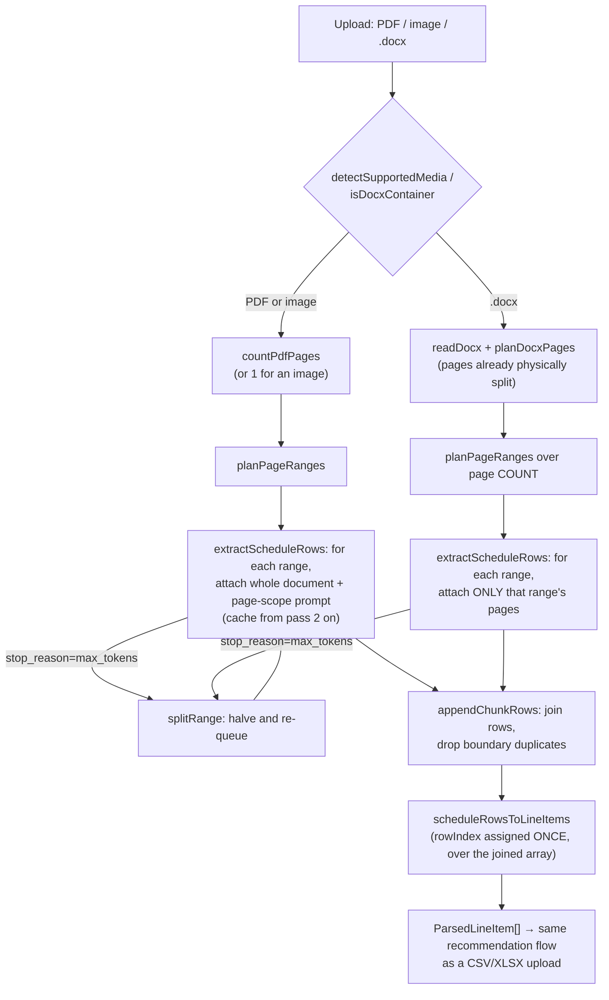
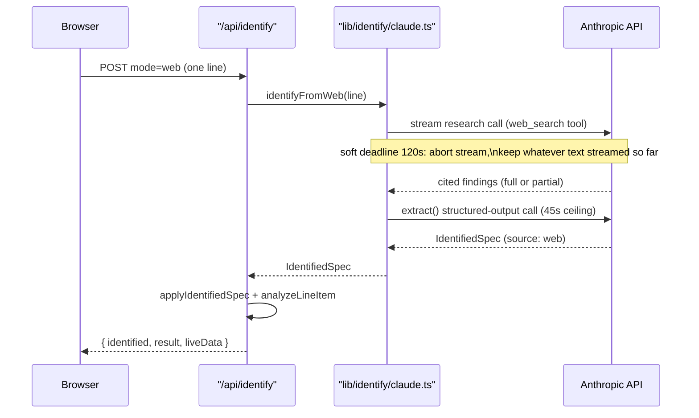
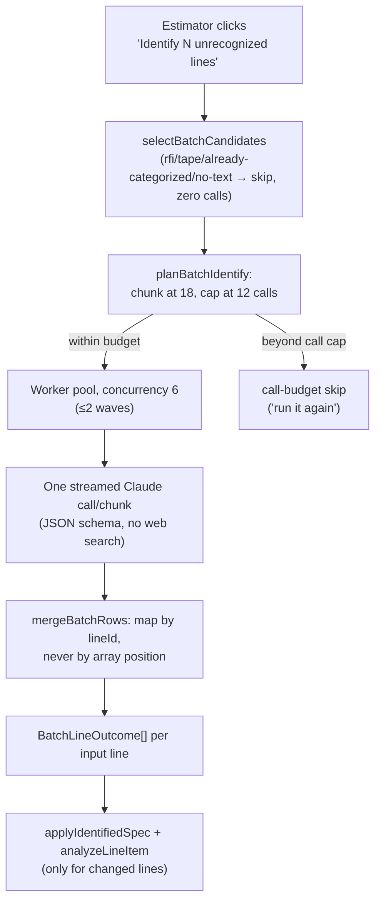

# Spec Identification

This subsystem exists to turn a line the recommendation engine cannot score —
because the sheet itself is unreadable, or because the line's own text
doesn't identify a product — into an `IdentifiedSpec` the engine can act on.
It has three entry points that share a wire contract but differ sharply in
cost profile and trigger:

1. **Upload-time schedule extraction** (`lib/identify/schedule.ts`,
   `lib/identify/docxPages.ts`) — when the uploaded document is a PDF, image,
   or Word file rather than a pre-converted CSV/XLSX, Claude reads it and
   returns structured line items.
2. **Per-line identify** (`lib/identify/claude.ts`) — one line, one user
   click: paste a spec URL, run a web search, or upload a cut sheet.
3. **Batch category identification** (`lib/identify/batch.ts`) — a single
   user-triggered pass that sweeps a whole sheet's *uncategorized* lines in
   chunks, deliberately amending the "never sweep a sheet" rule under tight
   cost caps.

All three ultimately produce an `IdentifiedSpec`
(`lib/identify/types.ts`) that is merged into the line with
`applyIdentifiedSpec` (`lib/identify/apply.ts`) and re-scored by
`analyzeLineItem`. Scoring itself — category gates, the in-category
fallback, history matching — belongs to the
[recommendation engine](/openwiki/engine/recommendation-engine.md) and is not
re-documented here.

> This repository is public. Never add a real customer bid workbook or a real
> fixture-schedule document as a test fixture — the identify and batch test
> suites use synthetic, invented brands and part numbers only.

## The shared contract: `IdentifiedSpec`

`lib/identify/spec.ts` is the SDK-free, side-effect-free module every
identification path builds on:

- `specSchemaProperties()` / `specSchema()` build the JSON-schema the model's
  structured output must conform to. Critically, the `category` enum is built
  live from `ENGINE_CATEGORY_LABELS`, i.e. `Object.keys(CATEGORY_GROUPS)` in
  `lib/engine/matcher.ts` — the model is constrained to labels the engine's
  category gates actually understand.
- `toIdentifiedSpec(raw, source)` normalizes the raw model payload,
  re-validating `category` against the engine vocabulary even though the
  schema already constrains it — a label the model hallucinates outside the
  enum, or that arrives some other way, would otherwise silently pass every
  downstream category gate as an untracked non-match rather than failing
  loudly.
- `IdentifySource` is `'url' | 'web' | 'pdf' | 'batch'`, kept distinct in the
  type on purpose: a UI or a future scoring pass can tell "text-only
  inference from a bid line" (`batch`) apart from "evidence-backed read of an
  actual spec sheet" (`pdf`/`url`/`web`).

Because `spec.ts` has no Anthropic import and no server-only guard, its
schema-building and normalization logic is unit-tested with no API key and
no network — `lib/identify/claude.ts` (per-line) and `lib/identify/batch.ts`
(sheet-level) both depend on it so the two paths cannot drift onto different
category vocabularies.

### Merging back into the line: `applyIdentifiedSpec`

`lib/identify/apply.ts` is a pure function every identify mode ends with:

- The estimator's **typed** catalog number stays the line's `catalogNumber`
  whenever it is usable (non-empty and not a pasted URL) — overwriting it
  with the identified part number would silently disconnect the line from
  any prior history keyed on the original text (a regression once observed
  live: identifying a line left its recommendations looking untouched
  because the history key had changed out from under them).
- The identified value is never lost even when it doesn't overwrite: it is
  carried on `line.identified`, and the engine reads both keys when scoring,
  so identification can only *add* matches, never erase the estimator's own
  spec.
- `catalogNumber` is only replaced by the identified value when there is
  nothing usable to keep (an empty cell, or a pasted spec-sheet URL sitting
  in the catalog cell).

## Base-item extraction: why `4430802-112` fails and `4430802` succeeds

`lib/identify/catalogNumber.ts` is the pure, testable half of a lesson learned
from live use: a fixture schedule prints the **ordering string**, not the
product. `VISUAL COMFORT 4430802-112` names one product — `4430802`, a
two-light bar vanity — configured in finish `112`. Searching the whole string
returns almost nothing; searching the base item number returns the
manufacturer page, the product type, and the finish list.

`splitCatalogParts` strips only **trailing** tokens, and only while what
remains still reads as a real item number (`isUsableBase`): it recognizes
color-temperature codes (`30K`, `3CCT`), wattage (`15W`), lumens (`4000LM`),
CRI (`80CRI`), voltage (`120V`, `MVOLT`), an explicit vocabulary of finish
words/abbreviations (`WHITE`, `BZ`, `PC`, …), and slash-delimited option
groups (`120/277V`, `30K/40K`) via `isOptionToken`. A bare trailing 2-4 digit
run after a substantial core is also treated as an option code
(`NUMERIC_OPTION`), which is what actually splits `4430802-112` into base
`4430802` + option `112`. `splitCatalogAlternates` additionally splits a cell
that lists several catalog numbers at once (`"4430802-112 / 4430804-112"`)
into individual candidates, conservatively — a slash embedded in one part
number (`120/277V`) must not be mistaken for a delimiter between two
different products.

`planCatalogSearch(spec)` is the plan every identification prompt consumes:
the printed alternates, the deduped base numbers to actually search, the
deduped option codes to mention as configuration context (never as search
terms), and `hasBase` (whether stripping changed anything worth telling the
model). `lib/identify/claude.ts` uses this plan both to build `lineContext`
(handed to every mode, so even a document-based identify knows `112` is a
finish code and won't report the configured string as the product's
identity) and to build the search queries in `identifyFromWeb`.

This module is **deliberately separate from `lib/engine/matcher.ts`**: the
engine's series/family matching logic is measured by an eval ratchet and must
never move because an identification-prompt change shipped. Nothing in
`lib/engine/matcher.ts` imports from `catalogNumber.ts`, and nothing here is
imported by the engine — the boundary is structural, not just a comment.

## Flow 1 — Upload-time schedule extraction

`app/api/upload/route.ts` accepts either a pre-converted CSV/XLSX (the
Phase-1 known-column parser, `lib/parse/workbook.ts`) or a document Claude
reads natively: PDF, image (PNG/JPEG/GIF/WebP), or Word (`.docx`). The upload
type is **sniffed from the file's magic bytes**, never trusted from the
filename or browser-supplied MIME (`detectSupportedMedia` in
`lib/identify/media.ts`) — a schedule photo saved as `schedule.pdf`, or a JPEG
mislabelled as PNG, both fail loudly against the Anthropic API otherwise. A
`.docx`/`.xlsx` ambiguity (both are ZIP containers) is resolved by reading the
ZIP directory (`isDocxContainer`), not the extension.

### Why long documents are read in page-range passes

`lib/identify/schedule.ts` is server-only. A single extraction call has an
output ceiling (`MAX_OUTPUT_TOKENS = 32000`); a normal 200-line schedule
already produced a truncation error ("split the PDF and try again") that lost
an upload in live use. So extraction is planned over `PageRange`s rather than
attempted in one call:

- `planPageRanges(pageCount, pagesPerChunk = PAGES_PER_CHUNK, maxChunks = MAX_CHUNKS)`
  — `PAGES_PER_CHUNK = 8` pages/pass, `MAX_CHUNKS = 12` passes. A document at
  or under one chunk's pages (or whose page count could not be determined at
  all) is always a single whole-document pass, so the common case never gets
  more expensive. A document beyond `maxChunks * pagesPerChunk` pages throws
  rather than looping.
- The final range is left open-ended (`end: null`) so an undercounted page
  total can never drop the tail of a document. `countPdfPages`
  (`lib/identify/pdfPages.ts`) reads a PDF's own `/Count` and `/Type /Page`
  markers — deliberately without a PDF library — and is biased high for
  exactly this reason; it returns `null` when nothing usable can be read, in
  which case the caller falls back to one whole-document pass.
- A pass whose response hits `stop_reason === 'max_tokens'` is treated as
  `truncated: true`; its rows are discarded and the range is halved
  (`splitRange`) and re-queued rather than the upload failing outright.
- Section/location carry-over (`lastSectionOf`, `buildSchedulePrompt`): a
  schedule prints a heading like `"LEVEL 2 — CORRIDOR"` once and runs rows
  under it for several pages, so a pass that starts mid-run has no heading of
  its own to read. Each pass is told the heading that was in force at the end
  of the previous pass, and told to stop trusting it as soon as the document
  shows a new one.
- Duplicate rows at a chunk boundary are handled conservatively
  (`appendChunkRows`): only the head of an incoming pass's rows is checked
  against the tail of what's already accumulated (`BOUNDARY_LOOKBACK = 2`),
  and only on an exact mark+catalog+quantity match — dropping a real repeated
  fixture elsewhere in the schedule would be worse than keeping one duplicate.

Every pass logs its own token usage (`input_tokens`, `output_tokens`,
`cache_read_input_tokens`, and the page range) as a single-line
`[identify] source=schedule …` message, so a chunked read is exactly as
observable in logs as a single-call one.

For a PDF or image, `extractScheduleFromDocument` attaches the **whole
document on every pass** with an ephemeral cache breakpoint set from the
second pass on — the Messages API has no page-selection parameter, so page
scope for a PDF/image is an *instruction* in the prompt, not a physical
split, and caching keeps every pass after the first from re-billing full
input price for the same bytes.

*Planning and joining a schedule extraction: PDFs/images attach the whole document per pass with an instructed page scope, while Word documents are physically sliced into per-pass page lists.*

### Why a Word file is usually pre-split into page images by the browser

`lib/parse/docx.ts` is deliberately **isomorphic** (no `node:zlib`, no
`Buffer`) because it has two callers: the API route reads a `.docx`
server-side, and `app/prepareUpload.ts` reads one **in the browser** before
upload. A `.docx` is a ZIP; the reader walks it (bounding both declared and
actual inflated size per entry, `MAX_ENTRY_BYTES` / `MAX_TOTAL_INFLATED_BYTES`,
against a maliciously mis-declared ZIP) and returns an ordered list of
`blocks` — text and images interleaved as they appear in the document — plus
the flat list of `images` and the document's own `text`. This matters because
real schedule `.docx` files come in two shapes that both have to work: some
are genuine Word **tables** (rows become pipe-delimited text blocks), and many
are **pasted-in screenshots** of the schedule sheets out of the drawing set,
with a caption paragraph above each image.

`lib/identify/docxPages.ts` (`planDocxPages`) turns that block list into the
`SchedulePage[]` the extractor reads, and deliberately treats the two shapes
as **both present, never either/or**: naively picking "the image path
whenever any image survived" would mean an ordinary Word-table schedule with
a letterhead logo sent the logo as its only page and demoted the real table
to "context, not line items" — silently suppressing every row in it. So both
image pages and table-text pages are collected in document order; only
genuine prose (captions, index text, general notes) becomes shared `context`
sent with every pass. The caption immediately above an image becomes that
page's `label`, which is where a row's `section`/location typically comes
from once extracted.

Word documents take the **page-list** extraction path,
`extractScheduleFromPages` in `lib/identify/schedule.ts`, which is a stricter
variant of the PDF path: instead of attaching the whole document with an
instructed scope, each pass physically slices `pages.slice(from, to)` and
attaches *only* those pages — a page outside a pass's range is not in the
request at all, so it can never be double-read or silently dropped the way an
instruction-only scope theoretically could be. `MAX_PAGES = PAGES_PER_CHUNK *
MAX_CHUNKS` caps total pages per upload; document text sent as context is
truncated to `MAX_CONTEXT_CHARS = 6,000` characters because it is re-sent on
every pass.

**Why the browser pre-splits at all:** Vercel refuses a request body over 4.5
MB at the platform edge, *before* the route ever runs, and the browser
reports that failure as a bare "Failed to fetch" with no readable status — a
4.9 MB Word schedule hit exactly this in live use. A schedule `.docx`'s bulk
is almost entirely its embedded page screenshots (tens of KB of XML wrapped
around megabytes of PNGs), so `app/prepareUpload.ts`:

- computes `PLATFORM_BODY_LIMIT_BYTES = floor(4.5 MB)` and reserves
  `MULTIPART_RESERVE_BYTES = 64 KB` of headroom for multipart framing, giving
  `UPLOAD_BUDGET_BYTES`;
- `prepareWordUpload(file)` reads the `.docx` client-side and, **only when it
  has page images and no table rows** (a table's content is a few KB of text
  and already fits; sending only recompressed images would silently drop a
  table schedule's real content), re-encodes each page image as JPEG scaled
  to at most `MAX_PAGE_EDGE_PX = 1568` px on its long edge — the vision API
  downsamples past that edge anyway, so nothing is lost — trying quality
  steps `[0.85, 0.7, 0.55]` until the whole document's encoded size fits the
  budget;
- posts the recompressed pages as repeated `page` parts, plus `pageLabel`,
  `docText` (truncated to the same 6,000-char mirror of
  `MAX_CONTEXT_CHARS`), and `fileName`;
- returns `null` when no shrinking is needed or possible from here (table
  rows present, or already small), meaning "post the raw `.docx` and let the
  route read it" — the raw path is the *same* reading and extraction code,
  reachable whenever the file is already small enough to arrive intact.
- `tooLargeForUpload(file)` gives the estimator an upfront, readable error
  instead of letting the platform's silent edge rejection surface as "Failed
  to fetch".

`app/api/upload/route.ts`'s `handlePreparedPages` accepts the browser's
pre-split `page`/`pageLabel`/`docText`/`fileName` parts, re-sniffs each page's
bytes with the same `detectSupportedMedia` used everywhere else (a
browser-mislabelled page must not reach the API with the wrong media type),
and hands them to `extractScheduleFromPages` exactly as `handleDocx` does for
a `.docx` that arrived whole.

## Flow 2 — Per-line identify (`lib/identify/claude.ts`)

`app/api/identify/route.ts` (`POST /api/identify`) is **strictly one line per
request, always user-triggered from a UI click** — the module-level comment
in `claude.ts` calls this the Phase 2 rule and states plainly that nothing in
the file may ever be called in a loop over a sheet. Three modes:

- **`url`** — the estimator pastes a spec link. `lib/identify/fetchUrl.ts`
  fetches it server-side with SSRF hygiene (`isFetchableSpecUrl`): only public
  `http(s)` hosts, rejecting `localhost`, `.local`/`.internal` suffixes,
  loopback/RFC1918/link-local numeric IPs, and IPv6 loopback. The fetch itself
  has a 10s timeout (`FETCH_TIMEOUT_MS`), a 10 MB body cap
  (`MAX_BODY_BYTES`), and only accepts `text/html`/`text/plain`/PDF content
  types. HTML is stripped to readable text (`htmlToText`, regex-based, no DOM
  dependency) and truncated to `MAX_TEXT_CHARS = 40,000` characters before it
  ever reaches Claude — spec pages are template-heavy and tags are pure token
  waste. A PDF response goes to `identifyFromDocument`; text goes to
  `identifyFromText`. If the direct fetch fails (a common outcome — many
  manufacturer sites bot-block a server fetch with 403), the route falls back
  to `identifyFromWeb(lineItem, blockedUrl)`, treating the pasted URL as the
  primary lead for a web search rather than failing the line outright.
- **`pdf`** — the estimator uploads a cut sheet (PDF or photo/screenshot,
  again sniffed by bytes via `detectSupportedMedia`). Claude reads it natively
  through vision; the `IdentifySource` stays `'pdf'` for an image too, because
  that value is the route's public contract ("identified from an uploaded
  document") and the UI renders it as "spec sheet".
- **`web`** — the "Look up spec" button, `identifyFromWeb`. This is the only
  mode that performs a research turn (`web_search` tool, `max_uses: 4`) ahead
  of extraction, because structured output and search citations cannot share
  one Claude response — the module always makes **two calls**: a research
  call with `RESEARCH_SYSTEM_PROMPT`, then the shared structured-output
  extraction (`extract`, shared by all three modes) over the findings. The
  research prompt explicitly searches the **base item number** from
  `planCatalogSearch`, not the full ordering string, and asks for the
  product's high-level identity (type, size, lamp count, mounting, the
  finish/CCT options the family offers) rather than an exact configured-SKU
  match, because a configuration-exact product page usually doesn't exist.

### Timeout/streaming budget for web research

The `web` mode's timeout chain is deliberately tight and was tuned against a
real failure mode: at a 90s research ceiling, "Look up spec" had *never once
succeeded* in live use, because a server-side `web_search` turn that runs
several searches and reads the pages it finds routinely needs longer than
90s — every attempt surfaced as "Request timed out." on work that was
actually going fine.

- `RESEARCH_TIMEOUT_MS = 150_000` — hard ceiling on the research call.
- `RESEARCH_SOFT_DEADLINE_MS = 120_000` — the research turn is **streamed**,
  and a timer aborts the stream at this soft deadline; whatever text has
  streamed so far is then used as the findings for extraction instead of
  being thrown away. A lookup that already found the product degrades to a
  partial answer rather than to a hard failure. Only when *nothing* streamed
  before the abort does the call actually fail.
- `EXTRACT_TIMEOUT_MS = 45_000` — ceiling on the shared structured-output
  extraction call.
- The whole chain is budgeted end to end: `150s (research hard) + 45s
  (extract) = 195s`, kept under the client-side abort (240s), which is kept
  under the route's `maxDuration = 300`. `maxRetries: 0` everywhere
  (`lib/identify/anthropic.ts`) is load-bearing here — the SDK's default two
  retries would silently turn a 150s ceiling into 450s and keep billing work
  long after the UI had already given up.

*The two-call web-lookup chain for one line: a streamed research turn with a soft deadline, then structured-output extraction over the findings.*

## Flow 3 — Batch category identification (`lib/identify/batch.ts`)

`POST /api/identify-batch` is a **deliberate, documented amendment** to the
Phase 2 "never sweep a whole sheet" rule, not a violation of it. The rule
existed to ban a specific cost profile — one Claude call per line, so 472
uncategorized lines meant 472 calls each with its own research turn — and
that profile is still banned inside `lib/identify/claude.ts`. Batch
identification is a structurally different profile: **one call per chunk of
~18 lines**, a hard cap on calls per request, **no web search at all**, and
still reachable *only* from an explicit "Identify N unrecognized lines"
button — nothing fires it on upload.

The motivating measurement, recorded in the module header: the engine's
text-only category detector (`detectFixtureCategory`) returns `null` on 472
of 966 eval-corpus lines, and 100% of lines where the engine shows the
estimator *nothing at all* are null-category lines (the in-category fallback
in `lib/engine/recommend.ts` is gated entirely on having a non-null
category). Injecting the true category on those lines in an oracle experiment
— nothing else changed — moved top-1 accuracy from 8.2% to 34.5% and dropped
fully-silent lines from 80.2% to 4.6%. That is the gap this pass exists to
close.

### Candidate selection (pure, cost-inspectable without a network call)

`selectBatchCandidates(lines)` decides, per line and in the same order
`analyzeLineItem`'s own pre-checks run, whether a line is worth a call at
all — a sheet the engine already fully understands costs **zero** calls:

- `rfi-placeholder` / `led-tape` — the engine deliberately refuses to guess
  on RFI/TBD placeholders or bids LED tape as-spec, so identifying either
  would only spend tokens the engine will ignore.
- `already-categorized` — either a prior identification (any source) already
  carries a category the engine accepts, or the text detector
  (`detectFixtureCategory`, using a locally-replicated `fixtureTypeHintFor`
  that mirrors — but does not import — the engine's own fixture-type-hint
  logic) already resolves one.
- `no-spec-text` — nothing to reason from (a pasted spec URL alone doesn't
  count; that belongs to the per-line "Identify from link" flow that actually
  fetches the page).
- Everything else becomes a `BatchCandidate` with an opaque, per-request
  `lineId` (`L1`, `L2`, …) assigned over the candidate list — not the sheet —
  so ids stay short and dense inside a chunk, while `index`/`rowIndex` travel
  alongside for unambiguous mapping back to the caller's array.

`planBatchIdentify(lines, { chunkSize, maxCalls })` is the pure, side-effect-free
planning function that turns candidates into `chunkCandidates` and applies
the call cap — candidates beyond the cap are reported as `call-budget` skips
with a "run it again" note, **never silently dropped**. Because this whole
path is pure up to this point, the cost of a sheet can be inspected before a
single token is spent, and it is exactly what the unit tests in
`__tests__/identify-batch.test.ts` pin.

### Cost/latency guardrails (safety-relevant — do not regress silently)

| Constant | Value | Why |
|---|---|---|
| `BATCH_CHUNK_SIZE` | 18 lines/call | Set from measurement, not estimate: a first live run at 25 lines/chunk produced 8,003–10,961 output tokens (~380/line vs. a design assumption of ~250), using 69% of `max_tokens` on the worst chunk. 18 lines restores headroom (~6.8k tokens expected, ~43% of the cap) at the cost of a couple of extra calls on a full sheet. |
| `MAX_BATCH_CALLS` | 12 calls/request | Hard ceiling so a pathological upload cannot run away; caps one pass at 216 lines, with the remainder reported as `call-budget` skips. |
| `BATCH_CONCURRENCY` | 6 in flight | At most `ceil(12/6) = 2` waves. |
| `BATCH_CALL_TIMEOUT_MS` | 120,000 ms | Per-call latency ceiling. |
| `BATCH_TOTAL_BUDGET_MS` | 240,000 ms | Wall-clock budget for the whole batch; a chunk that cannot finish inside it is never started (reported as `call-budget` instead), so no call bills for work the route will never return. |
| `BATCH_MAX_TOKENS` | 16,000 | Output ceiling/call — ~2.5× the expected size of a full chunk. |
| `MAX_FIELD_CHARS` | 220 | Longest field value sent to the model per line — long option strings are normal, essays are not. |

The full latency chain — `2 waves × 120s = 240s worst case < 270s client
abort (`BATCH_IDENTIFY_TIMEOUT_MS` in `app/page.tsx`) < 300s route
`maxDuration`` — mirrors the per-line budgeting discipline in `claude.ts`,
including `maxRetries: 0` for the same reason (a default retry would blow
the whole chain after the estimator had already given up).

Structurally, `identifyCategoriesInBatch` is the same shape
`lib/identify/schedule.ts` already proves in this codebase: one streamed
Claude call per chunk, `output_config` JSON schema, an array of rows back.
`batchSchema()` requires a `lineId` on every row (checked first in the
schema, so the model treats it as part of the record, not an afterthought) —
`mergeBatchRows` maps rows back onto lines **by that id, never by array
position**: an unknown id is dropped and reported, a repeated id keeps only
the first occurrence, and a candidate the model never answered for comes back
`no-result` rather than silently vanishing. Position-based mapping was
explicitly rejected because a model that reorders, drops, or duplicates rows
would otherwise attach one line's identification to a *different* line — a
worse outcome than no identification at all.

A failing chunk never fails the whole batch: its lines come back with
`skipped: 'error'` and the caught message, while every other chunk still
lands (`Promise.all` over a fixed pool of `worker()` loops pulling from a
shared `next` index — a simple concurrency-limited queue, not a library).

`app/api/identify-batch/route.ts` accepts an optional `rowIndexes` array to
narrow the swept set to the estimator's own selection — motivated by a real
sheet where 21 of 33 unrecognized lines were bare `TBD` placeholders with
nothing for Claude to work from; which lines are worth a call is a judgment
about the *document* that only the person reading it can make. Omitting
`rowIndexes` means every eligible candidate; a present-but-malformed value is
rejected outright rather than silently treated as "everything" (treating a
client typo as "identify everything" would turn a mistake into an
uncontrolled sweep of a paid service). The route also prefetches
`getEngineContext()` concurrently with the Claude calls, so a cold Airtable
pull overlaps identification instead of stacking after it, and re-analyzes
only the lines identification actually changed — never the whole sheet,
which would discard prior per-line identifications made by the estimator.

*Batch category identification: a bounded, user-triggered sheet sweep with per-chunk calls, a hard call cap, and id-based (not positional) result merging.*

## Extension points and invariants worth preserving

- **Category vocabulary is single-sourced.** Both `claude.ts` and `batch.ts`
  build their category constraint from `ENGINE_CATEGORY_LABELS` in
  `spec.ts`, which reads `CATEGORY_GROUPS` from `lib/engine/matcher.ts`.
  Adding an engine category makes it automatically identifiable by every
  path; nothing in this subsystem should hardcode its own label list.
- **`catalogNumber.ts` must stay import-isolated from `lib/engine/matcher.ts`**
  so an identification-prompt tweak can never move the eval-ratcheted engine
  matching logic, and vice versa.
- **Token usage logging is a guardrail, not incidental.** Every Claude call
  in all three flows logs a single `[identify] source=… stage=… model=…
  input_tokens=… output_tokens=…` line (with `cache_read_input_tokens` when
  applicable). Removing or reformatting these breaks the operational ability
  to grep cost across the whole subsystem in one pattern.
- **`maxRetries: 0` and the timeout budgets are load-bearing**, not
  defensive padding — every latency chain in this doc (per-line web lookup,
  batch chunk waves, per-pass schedule extraction) is sized assuming zero SDK
  retries; restoring the SDK default (2) would roughly triple worst-case
  latency past the client-side abort in every one of the three flows.
- **The batch call cap and chunk size are measured, not assumed** — see the
  guardrail table above. Changing `BATCH_CHUNK_SIZE` without re-measuring
  output tokens/line risks silently eating into the `max_tokens` headroom
  that keeps a chunk from truncating.
- Identity-linked Anthropic API keys require `ANTHROPIC_WORKSPACE_ID`
  (`lib/identify/anthropic.ts`) — without it, every Claude-backed feature in
  this subsystem (schedule reading, per-line identify, batch) fails a bare
  `messages.create` call with a 400.

## Related pages

- [Recommendation Engine](/openwiki/engine/recommendation-engine.md) — what
  happens to a line once `applyIdentifiedSpec` has merged an `IdentifiedSpec`
  into it (category gates, in-category fallback, history matching).
- [Airtable Integration](/openwiki/data/airtable-integration.md) — `getEngineContext`,
  prefetched alongside batch identification calls.
- [Architecture Overview](/openwiki/architecture/overview.md)
- [Testing and CI](/openwiki/operations/testing-and-ci.md) — the synthetic
  fixtures used by `__tests__/identify.test.ts` and
  `__tests__/identify-batch.test.ts`.
